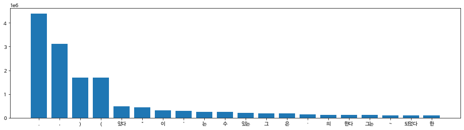
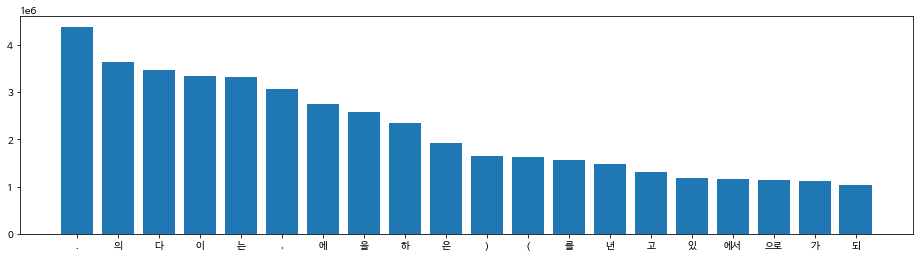

#  한글폰트


```python
# 폰트 설치
!apt-get update -qq # 나눔고딕 설치
!apt-get install fonts-nanum* -qq

import matplotlib as mpl
import matplotlib.pyplot as plt
import matplotlib.font_manager as fm

fontpath = '/usr/share/fonts/truetype/nanum/NanumBarunGothic.ttf'
font = fm.FontProperties(fname=fontpath, size=9)
plt.rc('font', family='NanumBarunGothic') 
mpl.font_manager._rebuild()
# 여기까지 실행 후 "런타임 다시 시작..." 실행 (이 부분은 실행할 필요 없음)
```


# Install


```python
# Tokenizer library 설치
!pip install sentencepiece
```

    Requirement already satisfied: sentencepiece in /usr/local/lib/python3.7/dist-packages (0.1.96)


# Evn


```python
# imports
import argparse
import os
import random
import shutil
import json
import zipfile
import math
import copy
import collections
import re

import matplotlib.pyplot as plt
import pandas as pd
import numpy as np
import sentencepiece as spm
import tensorflow as tf
import tensorflow.keras.backend as K

from tqdm.notebook import tqdm, trange
```


```python
# 환경 설정
args = {
    # random seed value
    "seed": 1234
}
args = argparse.Namespace(**args)

print(args)
```

    Namespace(seed=1234)


```python
# random seed 설정
random.seed(args.seed)
np.random.seed(args.seed)
tf.random.set_seed(args.seed)
```


```python
# gpu 사용량 확인
!nvidia-smi
```

    NVIDIA-SMI has failed because it couldn't communicate with the NVIDIA driver. Make sure that the latest NVIDIA driver is installed and running.


```python
# google drive mount
from google.colab import drive
drive.mount('/content/drive')
```

    Drive already mounted at /content/drive; to attempt to forcibly remount, call drive.mount("/content/drive", force_remount=True).


```python
# data dir
data_dir = '/content/drive/MyDrive/강의자료.202109/data'
os.listdir(data_dir)
```


    ['kowiki', 'hello1.json', 'hello.json', 'hello2.json']


```python
args.corpus = os.path.join(data_dir, "kowiki", "kowiki.txt.zip")
```

# 파일확인


```python
# wiki 라인수 확인
total_count = 0
with zipfile.ZipFile(args.corpus) as z:
    with z.open('kowiki.txt') as f:
        for i, line in enumerate(f):
            total_count += 1
print(total_count)
```

    3724301


```python
# wiki 내용 확인
with zipfile.ZipFile(args.corpus) as z:
    with z.open('kowiki.txt') as f:
        for i, line in enumerate(f):
            if i >= 50:
                break
            line = line.decode('utf-8').strip()
            print(line)
```

    지미 카터
    제임스 얼 "지미" 카터 주니어(, 1924년 10월 1일 ~ )는 민주당 출신 미국 39번째 대통령 (1977년 ~ 1981년)이다.
    지미 카터는 조지아주 섬터 카운티 플레인스 마을에서 태어났다. 조지아 공과대학교를 졸업하였다. 그 후 해군에 들어가 전함·원자력·잠수함의 승무원으로 일하였다. 1953년 미국 해군 대위로 예편하였고 이후 땅콩·면화 등을 가꿔 많은 돈을 벌었다. 그의 별명이 "땅콩 농부" (Peanut Farmer)로 알려졌다.
    1962년 조지아 주 상원 의원 선거에서 낙선하나 그 선거가 부정선거 였음을 입증하게 되어 당선되고, 1966년 조지아 주 지사 선거에 낙선하지만 1970년 조지아 주 지사를 역임했다. 대통령이 되기 전 조지아주 상원의원을 두번 연임했으며, 1971년부터 1975년까지 조지아 지사로 근무했다. 조지아 주지사로 지내면서, 미국에 사는 흑인 등용법을 내세웠다.
    1976년 대통령 선거에 민주당 후보로 출마하여 도덕주의 정책으로 내세워, 포드를 누르고 당선되었다.
    카터 대통령은 에너지 개발을 촉구했으나 공화당의 반대로 무산되었다.
    카터는 이집트와 이스라엘을 조정하여, 캠프 데이비드에서 안와르 사다트 대통령과 메나헴 베긴 수상과 함께 중동 평화를 위한 캠프데이비드 협정을 체결했다.
    그러나 이것은 공화당과 미국의 유대인 단체의 반발을 일으켰다. 1979년 백악관에서 양국 간의 평화조약으로 이끌어졌다. 또한 소련과 제2차 전략 무기 제한 협상에 조인했다.
    카터는 1970년대 후반 당시 대한민국 등 인권 후진국의 국민들의 인권을 지키기 위해 노력했으며, 취임 이후 계속해서 도덕정치를 내세웠다.
    그러나 주 이란 미국 대사관 인질 사건에서 인질 구출 실패를 이유로 1980년 대통령 선거에서 공화당의 로널드 레이건 후보에게 져 결국 재선에 실패했다. 또한 임기 말기에 터진 소련의 아프가니스탄 침공 사건으로 인해 1980년 하계 올림픽에 반공국가들의 보이콧을 내세웠다.
    지미 카터는 대한민국과의 관계에서도 중요한 영향을 미쳤던 대통령 중 하나다. 인권 문제와 주한미군 철수 문제로 한때 한미 관계가 불편하기도 했다. 1978년 대한민국에 대한 북한의 위협에 대비해 한미연합사를 창설하면서, 1982년까지 3단계에 걸쳐 주한미군을 철수하기로 했다. 그러나 주한미군사령부와 정보기관·의회의 반대에 부딪혀 주한미군은 완전철수 대신 6,000명을 감축하는 데 그쳤다. 또한 박정희 정권의 인권 문제 등과의 논란으로 불협화음을 냈으나, 1979년 6월 하순, 대한민국을 방문하여 관계가 다소 회복되었다.
    1979년 ~ 1980년 대한민국의 정치적 격변기 당시의 대통령이었던 그는 이에 대해 애매한 태도를 보였고, 이는 후에 대한민국 내에서 고조되는 반미 운동의 한 원인이 됐다. 10월 26일, 박정희 대통령이 김재규 중앙정보부장에 의해 살해된 것에 대해 그는 이 사건으로 큰 충격을 받았으며, 사이러스 밴스 국무장관을 조문사절로 파견했다. 12·12 군사 반란과 5.17 쿠데타에 대해 초기에는 강하게 비난했으나, 미국 정부가 신군부를 설득하는데, 한계가 있었고 결국 묵인하는 듯한 태도를 보이게 됐다.
    퇴임 이후 민간 자원을 적극 활용한 비영리 기구인 카터 재단을 설립한 뒤 민주주의 실현을 위해 제 3세계의 선거 감시 활동 및 기니 벌레에 의한 드라쿤쿠르스 질병 방재를 위해 힘썼다. 미국의 빈곤층 지원 활동, 사랑의 집짓기 운동, 국제 분쟁 중재 등의 활동도 했다.
    카터는 카터 행정부 이후 미국이 북핵 위기, 코소보 전쟁, 이라크 전쟁과 같이 미국이 군사적 행동을 최후로 선택하는 전통적 사고를 버리고 군사적 행동을 선행하는 행위에 대해 깊은 유감을 표시 하며 미국의 군사적 활동에 강한 반대 입장을 보이고 있다.
    특히 국제 분쟁 조정을 위해 북한의 김일성, 아이티의 세드라스 장군, 팔레인스타인의 하마스, 보스니아의 세르비아계 정권 같이 미국 정부에 대해 협상을 거부하면서 사태의 위기를 초래한 인물 및 단체를 직접 만나 분쟁의 원인을 근본적으로 해결하기 위해 힘썼다. 이 과정에서 미국 행정부와 갈등을 보이기도 했지만, 전직 대통령의 권한과 재야 유명 인사들의 활약으로 해결해 나갔다.
    1978년에 채결된 캠프데이비드 협정의 이행이 지지부진 하자 중동 분쟁 분제를 해결하기 위해 1993년 퇴임 후 직접 이스라엘과 팔레인스타인의 오슬로 협정을 이끌어 내는 데도 성공했다.
    1993년 1차 북핵 위기 당시 북한에 대한 미국의 군사적 행동이 임박했으나, 미국 전직 대통령으로는 처음으로 북한을 방문하고 미국과 북 양국의 중재에 큰 기여를 해 위기를 해결했다는 평가를 받았다. 또한 이 때 김영삼 대통령과 김일성 주석의 만남을 주선했다. 하지만 그로부터 수주일 후 김일성이 갑자기 사망하여 김일성과 김영삼의 정상회담은 이루어지지 못했다.
    미국의 관타나모 수용소 문제, 세계의 인권문제에서도 관심이 깊어 유엔에 유엔인권고등판무관의 제도를 시행하도록 노력하여 독재자들의 인권 유린에 대해 제약을 하고, 국제형사재판소를 만드는 데 기여하여 독재자들 같은 인권유린범죄자를 재판소로 회부하여 국제적인 처벌을 받게 하는 등 인권 신장에 크나 큰 기여를 했다.
    2011년 4월 26일부터 29일까지 북한을 3일간 방문했다.
    경제문제를 해결하지 못하고 주 이란 미국 대사관 인질 사건에 발목이 잡혀 실패한 대통령으로 평가를 받지만 이란 사태는 미국 내 이란 재산을 풀어주겠다는 조건을 내세워서 사실상 카터가 해결한 것이었고, 사랑의 집짓기 운동 등으로 퇴임 후에 훨씬 더 존경받는 미국 대통령 중에 특이한 인물로 남았다.
    그는 2002년 말 인권과 중재 역할에 대한 공로를 인정받아 노벨 평화상을 받게 되었다.


​    
​    
    수학
    수학(數學, ) 은 양, 구조, 공간, 변화, 미적분 등의 개념을 다루는 학문이다. 현대 수학은 형식 논리를 이용해서 공리로 구성된 추상적 구조를 연구하는 학문으로 여겨지기도 한다. 수학은 그 구조와 발전 과정에서는 자연과학에 속하는 물리학을 비롯한 다른 학문들과 깊은 연관을 맺고 있다. 하지만, 어느 과학의 분야들과는 달리, 자연계에서 관측되지 않는 개념들에 대해서까지 이론을 일반화 및 추상화시킬 수 있다는 차이가 있다고 한다. 수학자들은 그러한 개념들에 대해서 추측을 하고, 적절하게 선택된 정의와 공리로부터의 엄밀한 연역을 통해서 추측들의 진위를 파악한다.
    수학은 숫자 세기, 계산, 측정 및 물리적 대상의 모양과 움직임을 추상화하고, 이에 논리적 추론을 적용하여 나타났다. 이런 기본 개념들은 고대 이집트, 메소포타미아, 고대 인도, 고대 중국 및 고대 그리스의 수학책에서 찾아볼 수 있다. 그리고, 유클리드의 원론에서는 엄밀한 논증이 발견된다. 이런 발전은 그 뒤로도 계속되어, 16세기의 르네상스에 이르러서는 수학적 발전과 과학적 방법들의 상호 작용이 일어나, 혁명적인 연구들이 진행되며 인류 문명에 큰 영향을 미치게 되었다. 그리고, 이는 현재까지도 계속되고 있다.
    오늘날 수학은 자연과학, 공학, 의학뿐만 아니라, 경제학 등의 사회과학에서도 중요한 도구로서도 사용된다. 수학을 이런 분야들에 적용한 응용수학은 그 결과로써 수학 자체의 발전을 이끌고 새로운 분야들을 낳았다. 응용이 아닌 수학 자체의 아름다움과 재미를 추구하며 연구하는 것을 순수수학이라 하는데, 긴 시간이 지난 뒤에 순수수학적 연구를 다른 분야에 응용할 방법이 발견된 경우도 많았다고 한다.
    대부분 자료를 보면, "mathematics"는 "수리적인"이라는 뜻을 가진 라틴어 mathmaticus와 그리스어 mathematikos에서 유래되었거나, "학식있는"을 뜻하는 mathema와 "배우다"를 뜻하는 manthanein에서 유래되었다고 한다. 줄여서 "math"라고 표현하기도 한다.
    수학은 기원전 600년 경에 살았던 탈레스로부터 시작됐다. 하지만 탈레스가 태어나기 전에도 수학을 연구한 사람이 있을 수도 있기 때문에, 인류의 역사와 더불어 시작되었다고 할 수 있다. 교역•분배•과세 등의 인류의 사회 생활에 필요한 모든 계산을 수학이 담당해 왔고, 농경 생활에 필수적인 천문 관측과 달력의 제정, 토지의 측량 또한 수학이 직접적으로 관여한 분야이다. 고대 수학을 크게 발전시킨 나라로는 이집트, 인도, 그리스, 중국 등이 있다. 그 중에서도 그리스는 처음으로 수학의 방정식에서 변수를 문자로 쓴 나라이다.
    한국의 수학은 약 1,500년 전부터 기록으로 보이기 시작한다. 신라 시대에 수학을 가르쳤으며, 탈레스가 최초로 발견한 일식과 월식을 예측할 정도로 발달했다. 조선 시대에 훈민정음을 창제한 세종 대왕은 집현전 학자들에게 수학 연구를 명하는 등, 조선의 수학 수준을 향상시키기 위해서 많은 노력을 기울였다. 하지만 임진왜란으로 많은 서적들이 불타고, 천문학 분야에서 큰 손실을 입었다. 조선 후기의 한국의 수학은 실학자들을 중심으로 다시 발전하였고, 새로운 결과도 성취되었다.
    수학의 각 분야들은 상업에 필요한 계산을 하기 위해, 숫자들의 관계를 이해하기 위해, 토지를 측량하기 위해, 그리고 천문학적 사건들을 예견하기 위해 발전되어왔다. 이 네 가지 목적은 대략적으로 수학이 다루는 대상인 양, 구조, 공간 및 변화에 대응되며, 이들을 다루는 수학의 분야를 각각 산술, 대수학, 기하학, 해석학이라 한다. 또한 이 밖에도 근대 이후에 나타난 수학기초론과 이산수학 및 응용수학 등이 있다.
    산술은 자연수와 정수 및 이에 대한 사칙연산에 대한 연구로서 시작했다. 수론은 이런 주제들을 보다 깊게 다루는 학문으로, 그 결과로는 페르마의 마지막 정리 등이 유명하다. 또한 쌍둥이 소수 추측과 골드바흐 추측 등을 비롯해 오랜 세월 동안 해결되지 않고 남아있는 문제들도 여럿 있다.
    수의 체계가 보다 발전하면서, 정수의 집합을 유리수의 집합의 부분집합으로 여기게 되었다. 또한 유리수의 집합은 실수의 집합의 부분집합이며, 이는 또다시 복소수 집합의 일부분으로 볼 수 있다. 여기에서 더 나아가면 사원수와 팔원수 등의 개념을 생각할 수도 있다. 이와는 약간 다른 방향으로, 자연수를 무한대까지 세어나간다는 개념을 형식화하여 순서수의 개념을 얻으며, 집합의 크기 비교를 이용하여 무한대를 다루기 위한 또다른 방법으로는 기수의 개념도 있다.
    수 대신 문자를 써서 문제해결을 쉽게 하는 것과, 마찬가지로 수학적 법칙을 일반적이고 간명하게 나타내는 것을 포함한다. 고전대수학은 대수방정식 및 연립방정식의 해법에서 시작하여 군, 환, 체 등의 추상대수학을 거쳐 현대에 와서는 대수계의 구조를 보는 것을 중심으로 하는 선형대수학으로 전개되었다. 수의 집합이나 함수와 같은 많은 수학적 대상들은 내재적인 구조를 보인다. 이러한 대상들의 구조적 특성들이 군론, 환론, 체론 그리고 그 외의 수많은 대수적 구조들을 연구하면서 다루어지며, 그것들 하나하나가 내재적 구조를 지닌 수학적 대상이다. 이 분야에서 중요한 개념은 벡터, 벡터 공간으로의 일반화, 그리고 선형대수학에서의 지식들이다. 벡터의 연구에는 산술, 대수, 기하라는 수학의 중요한 세개의 분야가 조합되어 있다. 벡터 미적분학은 여기에 해석학의 영역이 추가된다. 텐서 미적분학은 대칭성과 회전축의 영향 아래에서 벡터의 움직임을 연구한다. 눈금없는 자와 컴퍼스와 관련된 많은 고대의 미해결 문제들이 갈루아 이론을 사용하여 비로소 해결되었다.
    공간에 대한 연구는 기하학에서 시작되었고, 특히 유클리드 기하학에서 비롯되었다. 삼각법은 공간과 수들을 결합하였고, 잘 알려진 피타고라스의 정리를 포함한다. 현대에 와서 공간에 대한 연구는, 이러한 개념들은 더 높은 차원의 기하학을 다루기 위해 비유클리드 기하학(상대성이론에서 핵심적인 역할을 함)과 위상수학으로 일반화되었다. 수론과 공간에 대한 이해는 모두 해석 기하학, 미분기하학, 대수기하학에 중요한 역할을 한다. 리 군도 공간과 구조, 변화를 다루는데 사용된다. 위상수학은 20세기 수학의 다양한 지류속에서 괄목할만한 성장을 한 분야이며, 푸앵카레 추측과 인간에 의해서 증명되지 못하고 오직 컴퓨터로만 증명된 4색정리를 포함한다.
    변화에 대한 이해와 묘사는 자연과학에 있어서 일반적인 주제이며, 미적분학은 변화를 탐구하는 강력한 도구로서 발전되었다. 함수는 변화하는 양을 묘사함에 있어서 중추적인 개념으로써 떠오르게 된다. 실수와 실변수로 구성된 함수의 엄밀한 탐구가 실해석학이라는 분야로 알려지게 되었고, 복소수에 대한 이와 같은 탐구 분야는 복소해석학이라고 한다. 함수해석학은 함수의 공간(특히 무한차원)의 탐구에 주목한다. 함수해석학의 많은 응용분야 중 하나가 양자역학이다. 많은 문제들이 자연스럽게 양과 그 양의 변화율의 관계로 귀착되고, 이러한 문제들이 미분방정식으로 다루어진다. 자연의 많은 현상들이 동역학계로 기술될 수 있다. 혼돈 이론은 이러한 예측 불가능한 현상을 탐구하는 데 상당한 기여를 한다.
    수학의 기초를 확실히 세우기 위해, 수리논리학과 집합론이 발전하였고, 이와 더불어 범주론이 최근에도 발전되고 있다. “근본 위기”라는 말은 대략 1900년에서 1930년 사이에 일어난, 수학의 엄밀한 기초에 대한 탐구를 상징적으로 보여주는 말이다. 수학의 엄밀한 기초에 대한 몇 가지 의견 불일치는 오늘날에도 계속되고 있다. 수학의 기초에 대한 위기는 그 당시 수많은 논쟁에 의해 촉발되었으며, 그 논쟁에는 칸토어의 집합론과 브라우어-힐베르트 논쟁이 포함되었다.


​    
​    
    수학 상수
    수학에서 상수란 그 값이 변하지 않는 불변량으로, 변수의 반대말이다. 물리 상수와는 달리, 수학 상수는 물리적 측정과는 상관없이 정의된다.
    수학 상수는 대개 실수체나 복소수체의 원소이다. 우리가 이야기할 수 있는 상수는 (거의 대부분 계산 가능한) 정의가능한 수이다.
    특정 수학 상수, 예를 들면 골롬-딕맨 상수, 프랑세즈-로빈슨 상수, formula_1, 레비 상수같은 상수는 다른 수학상수 또는 함수와 약한 상관관계 또는 강한 상관관계를 갖는다.


​    
​    
    문학
    문학(文學)은 언어를 예술적 표현의 제재로 삼아 새로운 의미를 창출하여, 인간과 사회를 진실되게 묘사하는 예술의 하위분야이다. 간단하게 설명하면, 언어를 통해 인간의 삶을 미적(美的)으로 형상화한 것이라고 볼 수 있다. 문학은 원래 문예(文藝)라고 부르는 것이 옳으며, 문학을 학문의 대상으로서 탐구하는 학문의 명칭 역시 문예학이다. 문예학은 음악사학, 미술사학 등과 함께 예술학의 핵심분야로서 인문학의 하위범주에 포함된다.

# Char Tokenizer

| 장점                                                         | 단점                                                         |
| ------------------------------------------------------------ | ------------------------------------------------------------ |
| - 모든 문장을 적은 수의 Vocabulary로 표현할 수  없음         | - 글자 단위로 분할하기 때문에 token 수가 많아짐(글자 수 만큼 생기기 때문에) (속도 ↓) |
| - Vocabulary에 글자가 없어서 '[UNK]'로 표현해야 하는 OOV(Out of Vocabulary) 문제가 발생할 가능성이 낮음 | -  각 글자 하나하나가 벡터로 표현됨 따라서 단어의 의미를 표현하기 어려움 |
|                                                              | - 이러한 문제를 해결하기 위해서 char기반의 Neural Networ은 많은 layer를 필요로 함 |


## 글자 수

- collecions.Counter()를 이용해서 list 안 의 값들의 수를 세준다. 이것을 char_counter_tmp에 저장하여 update를 통해 해당 리스트에 있는 값들의 수를 더해준다.


```python
char_counter_tmp = collections.Counter()

char_counter_tmp.update(list('아버지가 방에 들어가신다.'))
print(char_counter_tmp)
```

    Counter({'가': 2, ' ': 2, '아': 1, '버': 1, '지': 1, '방': 1, '에': 1, '들': 1, '어': 1, '신': 1, '다': 1, '.': 1})


### 실습
- 한국어 위키의 전체 글자수를 세어보세요.
- 위의 collections.Counter()를 활용하여 line을 업데이트해주면서 전체 글의 수를 구한다.


```python
char_counter = collections.Counter()
# char 개수 확인
with zipfile.ZipFile(args.corpus) as z:
    with z.open('kowiki.txt') as f:
        for line in tqdm(f, total=total_count):
            line = line.decode('utf-8').strip()
            char_counter.update(list(line))
```


      0%|          | 0/3724301 [00:00<?, ?it/s]


```python
# char 개수
print(len(char_counter))
```

    15581

- 빈도수가 가장 많은 글자를 출력해보니
  - 1위 : ' ' (띄어쓰기) , 2위:'이' , 3위 :'다' 등인 것을 알 수 있다. 즉, 글자별로 빈도 수를 더해주면 한글에 있는 조사들의 빈도가 높게 나올 수 밖에 없다. 또한, 띄어쓰기 등을 없애고 싶으면 strip 등을 이용해서 먼저 제거해준 후 글자의 빈도수를 세어줌으로써 해결할 수 있다.

```python
# 빈도수가 많은 글자 10개 출력
most_freq = sorted(char_counter.items(), key=lambda item: item[1], reverse=True)

most_freq[:10]
```


    [(' ', 55863103),
     ('이', 5799143),
     ('다', 5291578),
     ('.', 4395303),
     ('에', 4313327),
     ('의', 4228709),
     ('는', 3848984),
     ('로', 3112533),
     (',', 3110187),
     ('하', 2989928)]

- 그림으로 시각화해보자


```python
top_10 = most_freq[:10]

plt.figure(figsize=(10, 4))
plt.rc('font', family="NanumBarunGothic")
plt.rcParams["axes.unicode_minus"] = False # 한글 폰트 사용시 - 깨지는 문제 해결
plt.bar(range(len(top_10)), [val[1] for val in top_10])
plt.xticks(range(len(top_10)), [val[0] for val in top_10])
plt.show()
```


    

- 어떤 글자가 제일 사용되지 않았는지 살펴보면 한자가 1번씩으로 제일 사용되지 않았다는 것을 알 수 있따.

```python
# 빈도수가 적은 글자 10개 출력
least_freq = sorted(char_counter.items(), key=lambda item: item[1])

least_freq[:10]
```


    [('蔟', 1),
     ('蓓', 1),
     ('踢', 1),
     ('ǣ', 1),
     ('钊', 1),
     ('臄', 1),
     ('饀', 1),
     ('蝌', 1),
     ('廏', 1),
     ('Ꝩ', 1)]

- 전체 글자의 수(중복 포함) . 즉. 글자 개수


```python
# token 개수
count = 0
for c, cnt in char_counter.items():
    count += cnt
print(count)
```

    267502382


## Char ID vocab


```python
#[pad] 는 당신은 선생님 입니다. [pad][pad] 이런식으로 짧은 글자에 글자를 늘려주기 위해서 넣은 패드
#[UNK] : OOV가 났을 경우
char_to_id_tmp = {'[PAD]': 0, '[UNK]': 1}
for c, cnt in char_counter_tmp.items():
    char_to_id_tmp[c] = len(char_to_id_tmp)
print(char_to_id_tmp)
```

    {'[PAD]': 0, '[UNK]': 1, '아': 2, '버': 3, '지': 4, '가': 5, ' ': 6, '방': 7, '에': 8, '들': 9, '어': 10, '신': 11, '다': 12, '.': 13}


### 실습
- 전체 char counter에 일련번호를 부여한 char_to_id를 만들어 보세요.


```python
# char에 일련번호 부여
char_to_id = {'[PAD]': 0, '[UNK]': 1}
for c, cnt in char_counter.items():
  char_to_id[c]=len(char_to_id)

print(len(char_to_id))
```

    15583


```python
char_to_id
```


    {'[PAD]': 0,
     '[UNK]': 1,
     '지': 2,
     '미': 3,
     ' ': 4,
     '카': 5,
     '터': 6,
     '제': 7,
     '임': 8,
     '스': 9,
     '얼': 10,
     '"': 11,
     '주': 12,
     '니': 13,
     '어': 14,
     '(': 15,
     ',': 16,
     '1': 17,
     '9': 18,
     '2': 19,
     '4': 20,
     '년': 21,
     '0': 22,
     '월': 23,
     '일': 24,
     '~': 25,
     ')': 26,
     '는': 27,
     '민': 28,
     '당': 29,
     '출': 30,
     '신': 31,
     '국': 32,
     '3': 33,
     '번': 34,
     '째': 35,
     '대': 36,
     '통': 37,
     '령': 38,
     '7': 39,
     '8': 40,
     '이': 41,
     '다': 42,
     '.': 43,
     '조': 44,
     '아': 45,
     '섬': 46,
     '운': 47,
     '티': 48,
     '플': 49,
     '레': 50,
     '인': 51,
     '마': 52,
     '을': 53,
     '에': 54,
     '서': 55,
     '태': 56,
     '났': 57,
     '공': 58,
     '과': 59,
     '학': 60,
     '교': 61,
     '를': 62,
     '졸': 63,
     '업': 64,
     '하': 65,
     '였': 66,
     '그': 67,
     '후': 68,
     '해': 69,
     '군': 70,
     '들': 71,
     '가': 72,
     '전': 73,
     '함': 74,
     '·': 75,
     '원': 76,
     '자': 77,
     '력': 78,
     '잠': 79,
     '수': 80,
     '의': 81,
     '승': 82,
     '무': 83,
     '으': 84,
     '로': 85,
     '5': 86,
     '위': 87,
     '예': 88,
     '편': 89,
     '고': 90,
     '땅': 91,
     '콩': 92,
     '면': 93,
     '화': 94,
     '등': 95,
     '꿔': 96,
     '많': 97,
     '은': 98,
     '돈': 99,
     '벌': 100,
     '었': 101,
     '별': 102,
     '명': 103,
     '농': 104,
     '부': 105,
     'P': 106,
     'e': 107,
     'a': 108,
     'n': 109,
     'u': 110,
     't': 111,
     'F': 112,
     'r': 113,
     'm': 114,
     '알': 115,
     '려': 116,
     '졌': 117,
     '6': 118,
     '상': 119,
     '선': 120,
     '거': 121,
     '낙': 122,
     '나': 123,
     '정': 124,
     '음': 125,
     '입': 126,
     '증': 127,
     '게': 128,
     '되': 129,
     '사': 130,
     '만': 131,
     '역': 132,
     '했': 133,
     '기': 134,
     '두': 135,
     '연': 136,
     '며': 137,
     '까': 138,
     '근': 139,
     '내': 140,
     '흑': 141,
     '용': 142,
     '법': 143,
     '세': 144,
     '웠': 145,
     '보': 146,
     '여': 147,
     '도': 148,
     '덕': 149,
     '책': 150,
     '워': 151,
     '포': 152,
     '드': 153,
     '누': 154,
     '르': 155,
     '너': 156,
     '개': 157,
     '발': 158,
     '촉': 159,
     '구': 160,
     '반': 161,
     '산': 162,
     '집': 163,
     '트': 164,
     '와': 165,
     '라': 166,
     '엘': 167,
     '캠': 168,
     '프': 169,
     '데': 170,
     '비': 171,
     '안': 172,
     '메': 173,
     '헴': 174,
     '베': 175,
     '긴': 176,
     '께': 177,
     '중': 178,
     '동': 179,
     '평': 180,
     '한': 181,
     '협': 182,
     '체': 183,
     '결': 184,
     '러': 185,
     '것': 186,
     '유': 187,
     '단': 188,
     '켰': 189,
     '백': 190,
     '악': 191,
     '관': 192,
     '양': 193,
     '간': 194,
     '약': 195,
     '끌': 196,
     '또': 197,
     '소': 198,
     '련': 199,
     '차': 200,
     '략': 201,
     '시': 202,
     '권': 203,
     '진': 204,
     '키': 205,
     '노': 206,
     '취': 207,
     '계': 208,
     '속': 209,
     '치': 210,
     '란': 211,
     '질': 212,
     '건': 213,
     '실': 214,
     '패': 215,
     '널': 216,
     '져': 217,
     '재': 218,
     '말': 219,
     '탄': 220,
     '침': 221,
     '올': 222,
     '림': 223,
     '픽': 224,
     '콧': 225,
     '요': 226,
     '영': 227,
     '향': 228,
     '쳤': 229,
     '던': 230,
     '문': 231,
     '철': 232,
     '때': 233,
     '불': 234,
     '북': 235,
     '합': 236,
     '창': 237,
     '설': 238,
     '걸': 239,
     '쳐': 240,
     '회': 241,
     '딪': 242,
     '혀': 243,
     '완': 244,
     '감': 245,
     '축': 246,
     '박': 247,
     '희': 248,
     '논': 249,
     '냈': 250,
     '순': 251,
     '방': 252,
     '복': 253,
     '적': 254,
     '격': 255,
     '변': 256,
     '애': 257,
     '매': 258,
     '됐': 259,
     '김': 260,
     '규': 261,
     '앙': 262,
     '장': 263,
     '살': 264,
     '된': 265,
     '큰': 266,
     '충': 267,
     '받': 268,
     '았': 269,
     '밴': 270,
     '절': 271,
     '파': 272,
     '견': 273,
     '쿠': 274,
     '타': 275,
     '초': 276,
     '강': 277,
     '난': 278,
     '득': 279,
     '있': 280,
     '묵': 281,
     '듯': 282,
     '퇴': 283,
     '극': 284,
     '활': 285,
     '리': 286,
     '립': 287,
     '뒤': 288,
     '현': 289,
     '및': 290,
     '쿤': 291,
     '병': 292,
     '힘': 293,
     '썼': 294,
     '빈': 295,
     '곤': 296,
     '층': 297,
     '랑': 298,
     '짓': 299,
     '분': 300,
     '쟁': 301,
     '행': 302,
     '핵': 303,
     '코': 304,
     '크': 305,
     '같': 306,
     '최': 307,
     '택': 308,
     '버': 309,
     '깊': 310,
     '표': 311,
     '특': 312,
     '히': 313,
     '성': 314,
     '팔': 315,
     '래': 316,
     '물': 317,
     '직': 318,
     '접': 319,
     '본': 320,
     '갈': 321,
     '야': 322,
     '갔': 323,
     '채': 324,
     '오': 325,
     '슬': 326,
     '처': 327,
     '삼': 328,
     '석': 329,
     '남': 330,
     '갑': 331,
     '망': 332,
     '담': 333,
     '루': 334,
     '못': 335,
     '모': 336,
     '심': 337,
     '엔': 338,
     '판': 339,
     '록': 340,
     '독': 341,
     '린': 342,
     '형': 343,
     '범': 344,
     '죄': 345,
     '경': 346,
     '목': 347,
     '잡': 348,
     '풀': 349,
     '겠': 350,
     '훨': 351,
     '씬': 352,
     '더': 353,
     '존': 354,
     '할': 355,
     '벨': 356,
     '數': 357,
     '學': 358,
     '념': 359,
     '식': 360,
     '추': 361,
     '겨': 362,
     '롯': 363,
     '른': 364,
     '맺': 365,
     '느': 366,
     '달': 367,
     '측': 368,
     '않': 369,
     '론': 370,
     '킬': 371,
     '엄': 372,
     '밀': 373,
     '숫': 374,
     '움': 375,
     '런': 376,
     '찾': 377,
     '볼': 378,
     '클': 379,
     '네': 380,
     '호': 381,
     '작': 382,
     '혁': 383,
     '류': 384,
     '늘': 385,
     '날': 386,
     '뿐': 387,
     '응': 388,
     '써': 389,
     '새': 390,
     '낳': 391,
     '닌': 392,
     '름': 393,
     '우': 394,
     '료': 395,
     'h': 396,
     'i': 397,
     'c': 398,
     's': 399,
     '뜻': 400,
     '틴': 401,
     'k': 402,
     'o': 403,
     '배': 404,
     '줄': 405,
     '탈': 406,
     '람': 407,
     '•': 408,
     '생': 409,
     '필': 410,
     '든': 411,
     '왔': 412,
     '천': 413,
     '토': 414,
     '량': 415,
     '킨': 416,
     '쓴': 417,
     '훈': 418,
     '종': 419,
     '왕': 420,
     '준': 421,
     '울': 422,
     '왜': 423,
     '손': 424,
     '각': 425,
     '술': 426,
     '밖': 427,
     '칙': 428,
     '페': 429,
     '막': 430,
     '쌍': 431,
     '둥': 432,
     '골': 433,
     '바': 434,
     '흐': 435,
     '랜': 436,
     '럿': 437,
     '얻': 438,
     '쉽': 439,
     '찬': 440,
     '환': 441,
     '외': 442,
     '벡': 443,
     '텐': 444,
     '칭': 445,
     '눈': 446,
     '금': 447,
     '없': 448,
     '컴': 449,
     '퍼': 450,
     '잘': 451,
     '피': 452,
     '높': 453,
     '괄': 454,
     '푸': 455,
     '앵': 456,
     '퓨': 457,
     '색': 458,
     '묘': 459,
     '탐': 460,
     '떠': 461,
     '럽': 462,
     '율': 463,
     '귀': 464,
     '착': 465,
     '될': 466,
     '혼': 467,
     '능': 468,
     '확': 469,
     '“': 470,
     '”': 471,
     '징': 472,
     '몇': 473,
     '칸': 474,
     '브': 475,
     '-': 476,
     '힐': 477,
     '값': 478,
     '롬': 479,
     '딕': 480,
     '맨': 481,
     '즈': 482,
     '슨': 483,
     'f': 484,
     'l': 485,
     '_': 486,
     '갖': 487,
     '文': 488,
     '언': 489,
     '삶': 490,
     '美': 491,
     '的': 492,
     '藝': 493,
     '옳': 494,
     '텍': 495,
     '떤': 496,
     '흔': 497,
     '묶': 498,
     '헌': 499,
     '좀': 500,
     '곡': 501,
     '족': 502,
     '띨': 503,
     '닐': 504,
     '템': 505,
     '테': 506,
     '꼭': 507,
     '디': 508,
     '털': 509,
     '점': 510,
     '허': 511,
     '품': 512,
     '찰': 513,
     '떨': 514,
     '투': 515,
     '뢰': 516,
     '따': 517,
     '즉': 518,
     '춤': 519,
     '춘': 520,
     '演': 521,
     '劇': 522,
     '詩': 523,
     '散': 524,
     '뉜': 525,
     '즘': 526,
     '흥': 527,
     '씌': 528,
     '雜': 529,
     '짜': 530,
     '書': 531,
     '簡': 532,
     '험': 533,
     '特': 534,
     '定': 535,
     '時': 536,
     '傳': 537,
     '記': 538,
     '評': 539,
     '論': 540,
     '띠': 541,
     '냥': 542,
     '욕': 543,
     '저': 544,
     '므': 545,
     '황': 546,
     '켜': 547,
     '열': 548,
     '뉘': 549,
     '엮': 550,
     '렵': 551,
     '길': 552,
     '락': 553,
     '몬': 554,
     '참': 555,
     '化': 556,
     '광': 557,
     '맞': 558,
     '효': 559,
     '염': 560,
     '<': 561,
     'w': 562,
     '>': 563,
     '*': 564,
     '/': 565,
     ':': 566,
     'B': 567,
     'C': 568,
     '굴': 569,
     '검': 570,
     '빛': 571,
     '끓': 572,
     '벽': 573,
     '돌': 574,
     '녹': 575,
     '급': 576,
     'R': 577,
     'b': 578,
     'y': 579,
     '뿌': 580,
     '님': 581,
     '온': 582,
     '폐': 583,
     '쇄': 584,
     '압': 585,
     '례': 586,
     '《': 587,
     '》': 588,
     '획': 589,
     '믿': 590,
     '낸': 591,
     'é': 592,
     'D': 593,
     '컬': 594,
     '펌': 595,
     '컨': 596,
     '핑': 597,
     '죽': 598,
     '턴': 599,
     '엽': 600,
     'p': 601,
     '붙': 602,
     '낼': 603,
     '붕': 604,
     '괴': 605,
     'S': 606,
     'A': 607,
     'K': 608,
     '렬': 609,
     '혹': 610,
     '겪': 611,
     '끊': 612,
     '흡': 613,
     'Δ': 614,
     'H': 615,
     '눌': 616,
     '띤': 617,
     '륨': 618,
     'N': 619,
     '렇': 620,
     '액': 621,
     '겹': 622,
     '큼': 623,
     '청': 624,
     'O': 625,
     '욱': 626,
     '넓': 627,
     '송': 628,
     '믹': 629,
     '램': 630,
     '끼': 631,
     '커': 632,
     'X': 633,
     '틱': 634,
     '첸': 635,
     '캅': 636,
     '룹': 637,
     '섞': 638,
     '%': 639,
     '잉': 640,
     '슈': 641,
     '젊': 642,
     '맹': 643,
     '맥': 644,
     '웰': 645,
     'M': 646,
     'x': 647,
     '方': 648,
     '程': 649,
     '式': 650,
     '츠': 651,
     '펴': 652,
     '쿨': 653,
     '롱': 654,
     '밝': 655,
     '혔': 656,
     '앞': 657,
     '힌': 658,
     '척': 659,
     '닭': 660,
     '샤': 661,
     '틀': 662,
     '곱': 663,
     '웨': 664,
     'W': 665,
     '뜨': 666,
     '놓': 667,
     '둘': 668,
     '홀': 669,
     '力': 670,
     '線': 671,
     '먼': 672,
     '헤': 673,
     '윌': 674,
     '폭': 675,
     '쓰': 676,
     '덧': 677,
     '場': 678,
     '멕': 679,
     '렸': 680,
     '칼': 681,
     '케': 682,
     'µ': 683,
     '멀': 684,
     '훗': 685,
     '첫': 686,
     'G': 687,
     '超': 688,
     '越': 689,
     '항': 690,
     '빌': 691,
     '폰': 692,
     '겔': 693,
     '앨': 694,
     '音': 695,
     '階': 696,
     'v': 697,
     'd': 698,
     '半': 699,
     '뜸': 700,
     '솔': 701,
     '黃': 702,
     '鍾': 703,
     '♭': 704,
     '太': 705,
     '蔟': 706,
     '仲': 707,
     '呂': 708,
     '林': 709,
     '無': 710,
     '射': 711,
     '궁': 712,
     '變': 713,
     '徵': 714,
     '宮': 715,
     '뽑': 716,
     '즌': 717,
     '몽': 718,
     '총': 719,
     '넷': 720,
     '친': 721,
     '혜': 722,
     '십': 723,
     '끄': 724,
     '\xa0': 725,
     '렀': 726,
     '잃': 727,
     '륜': 728,
     '봉': 729,
     "'": 730,
     '풍': 731,
     '홍': 732,
     '럼': 733,
     '‘': 734,
     '’': 735,
     '습': 736,
     '컵': 737,
     '혈': 738,
     '냐': 739,
     '답': 740,
     '긍': 741,
     '꾸': 742,
     '싸': 743,
     '빨': 744,
     '낮': 745,
     '좋': 746,
     '씩': 747,
     '텔': 748,
     '앤': 749,
     '섰': 750,
     '밤': 751,
     '껴': 752,
     '끝': 753,
     '썩': 754,
     '몰': 755,
     '咸': 756,
     '錫': 757,
     '憲': 758,
     '릉': 759,
     '江': 760,
     '陵': 761,
     '信': 762,
     '天': 763,
     '씨': 764,
     '육': 765,
     '숙': 766,
     '一': 767,
     '亨': 768,
     '三': 769,
     '遷': 770,
     '齋': 771,
     '德': 772,
     '小': 773,
     '校': 774,
     '숭': 775,
     '촌': 776,
     '州': 777,
     '五': 778,
     '山': 779,
     '곳': 780,
     '內': 781,
     '村': 782,
     '鑑': 783,
     '金': 784,
     '敎': 785,
     '臣': 786,
     '宋': 787,
     '斗': 788,
     '用': 789,
     '鄭': 790,
     '相': 791,
     '勳': 792,
     '柳': 793,
     '東': 794,
     '楊': 795,
     '仁': 796,
     '性': 797,
     '聖': 798,
     '朝': 799,
     '鮮': 800,
     '객': 801,
     '글': 802,
     '〈': 803,
     '〉': 804,
     '옥': 805,
     '松': 806,
     '赫': 807,
     '鷄': 808,
     '友': 809,
     '會': 810,
     '事': 811,
     '件': 812,
     '弔': 813,
     '蛙': 814,
     '둑': 815,
     'Y': 816,
     '휴': 817,
     '익': 818,
     '놀': 819,
     '빙': 820,
     '떻': 821,
     '랄': 822,
     '빚': 823,
     '퀘': 824,
     'Q': 825,
     '派': 826,
     '좌': 827,
     '폈': 828,
     '윤': 829,
     '뷰': 830,
     '?': 831,
     '닙': 832,
     '옛': 833,
     '납': 834,
     '섭': 835,
     '암': 836,
     '읍': 837,
     '곧': 838,
     '듭': 839,
     '뤄': 840,
     '윈': 841,
     '뮤': 842,
     '줍': 843,
     '놈': 844,
     '빼': 845,
     '먹': 846,
     '넌': 847,
     '센': 848,
     '맸': 849,
     '白': 850,
     '南': 851,
     '準': 852,
     '水': 853,
     '原': 854,
     '뉴': 855,
     '쾰': 856,
     '쿄': 857,
     '머': 858,
     '녀': 859,
     '덴': 860,
     '쇤': 861,
     '뮌': 862,
     '헨': 863,
     '옮': 864,
     '션': 865,
     '릴': 866,
     '탁': 867,
     '콜': 868,
     '숨': 869,
     '넥': 870,
     '낭': 871,
     '젠': 872,
     '묻': 873,
     '셉': 874,
     '럭': 875,
     '벤': 876,
     '튜': 877,
     'T': 878,
     'V': 879,
     '탕': 880,
     '갤': 881,
     '덤': 882,
     '슐': 883,
     '릭': 884,
     '젖': 885,
     '킹': 886,
     '펼': 887,
     '큐': 888,
     '팅': 889,
     '봇': 890,
     '팩': 891,
     '촬': 892,
     '첼': 893,
     '샬': 894,
     '넣': 895,
     '섹': 896,
     '붓': 897,
     '휘': 898,
     'E': 899,
     '꾀': 900,
     '굿': 901,
     '닝': 902,
     '퐁': 903,
     '샌': 904,
     '링': 905,
     '[': 906,
     '草': 907,
     '月': 908,
     ']': 909,
     '콘': 910,
     'I': 911,
     '늑': 912,
     '엇': 913,
     '쮜': 914,
     '폴': 915,
     '틸': 916,
     '렉': 917,
     '닉': 918,
     '뇌': 919,
     '겐': 920,
     '눠': 921,
     '쪽': 922,
     '헝': 923,
     '튀': 924,
     '늄': 925,
     '段': 926,
     '狀': 927,
     '鑛': 928,
     '泉': 929,
     '솟': 930,
     '²': 931,
     '텝': 932,
     '흘': 933,
     '빠': 934,
     '젬': 935,
     '켈': 936,
     '륙': 937,
     '덜': 938,
     '덥': 939,
     'д': 940,
     'е': 941,
     'к': 942,
     'а': 943,
     'и': 944,
     'м': 945,
     'т': 946,
     'о': 947,
     'У': 948,
     'р': 949,
     'н': 950,
     'ѓ': 951,
     'с': 952,
     'л': 953,
     'в': 954,
     'п': 955,
     'у': 956,
     'ш': 957,
     'з': 958,
     'ч': 959,
     '„': 960,
     'г': 961,
     'б': 962,
     'ј': 963,
     '얇': 964,
     '끈': 965,
     '옷': 966,
     '삭': 967,
     '늬': 968,
     '톱': 969,
     '렛': 970,
     '둔': 971,
     '元': 972,
     '支': 973,
     '點': 974,
     '先': 975,
     '잎': 976,
     '綱': 977,
     '꽃': 978,
     '잔': 979,
     '튼': 980,
     '理': 981,
     '容': 982,
     '깎': 983,
     '쇠': 984,
     '짧': 985,
     '탑': 986,
     '웹': 987,
     'ˈ': 988,
     '꼽': 989,
     '얽': 990,
     '돕': 991,
     '칠': 992,
     '읽': 993,
     'L': 994,
     '윅': 995,
     '훼': 996,
     '쉬': 997,
     '넘': 998,
     '챌': 999,
     ...}


## Char to ID

- 위에 정해진 글자 사전을 만들어 뒀으니, '아버지가 을 방에 들어가신다'의 글을 ID로 변환해자 
  - 만약에 없을ㄷ경우에는 위에 UNK의 id로 정해둔 1로 주어주자


```python
#없으면 1로 줘라
_id = [char_to_id_tmp.get(c,1) for c in '아버지가 을 방에 들어가신다.']
_id
```

- 2: 아 3:버 4: 지 5:가 6:' ' 7: 을 6: ' ' 등으로 정해진 것을 알 수 있다.


    [2, 3, 4, 5, 6, 1, 6, 7, 8, 6, 9, 10, 5, 11, 12, 13]

- 이번엔 아이디에 글자 값을 아이템으로 넣어주기 위해 순서를 바꿔서 입력해준다.


```python
id_to_char_tmp = {v:k for k, v in char_to_id_tmp.items()}
id_to_char_tmp
```

- 반대로 key, items가 설정된 것을 확인할 수 있다.


    {0: '[PAD]',
     1: '[UNK]',
     2: '아',
     3: '버',
     4: '지',
     5: '가',
     6: ' ',
     7: '방',
     8: '에',
     9: '들',
     10: '어',
     11: '신',
     12: '다',
     13: '.'}

- 그러면 숫자로 입력된 것을 글자로 넣어 확인해보자


```python
''.join([id_to_char_tmp[i] for i in _id])
```

- 없는 단어인 '을'은 [UNK] , 나머지는 제대로 들어 간 것을 확인할 수 있다.


    '아버지가 [UNK] 방에 들어가신다.'


### 실습
- 한국어 위키의 5줄만 글자를 일련번호로 변경해 보세요.


```python
# wiki char tokenize
with zipfile.ZipFile(args.corpus) as z:
    with z.open('kowiki.txt') as f:
        for i, line in enumerate(f):
            if i >= 5:
                break
            line = line.decode('utf-8').strip()
            _id = [char_to_id.get(c, 1) for c in line]
            print(_id)
        
```

    [2, 3, 4, 5, 6]
    [7, 8, 9, 4, 10, 4, 11, 2, 3, 11, 4, 5, 6, 4, 12, 13, 14, 15, 16, 4, 17, 18, 19, 20, 21, 4, 17, 22, 23, 4, 17, 24, 4, 25, 4, 26, 27, 4, 28, 12, 29, 4, 30, 31, 4, 3, 32, 4, 33, 18, 34, 35, 4, 36, 37, 38, 4, 15, 17, 18, 39, 39, 21, 4, 25, 4, 17, 18, 40, 17, 21, 26, 41, 42, 43]
    [2, 3, 4, 5, 6, 27, 4, 44, 2, 45, 12, 4, 46, 6, 4, 5, 47, 48, 4, 49, 50, 51, 9, 4, 52, 53, 54, 55, 4, 56, 14, 57, 42, 43, 4, 44, 2, 45, 4, 58, 59, 36, 60, 61, 62, 4, 63, 64, 65, 66, 42, 43, 4, 67, 4, 68, 4, 69, 70, 54, 4, 71, 14, 72, 4, 73, 74, 75, 76, 77, 78, 75, 79, 80, 74, 81, 4, 82, 83, 76, 84, 85, 4, 24, 65, 66, 42, 43, 4, 17, 18, 86, 33, 21, 4, 3, 32, 4, 69, 70, 4, 36, 87, 85, 4, 88, 89, 65, 66, 90, 4, 41, 68, 4, 91, 92, 75, 93, 94, 4, 95, 53, 4, 72, 96, 4, 97, 98, 4, 99, 53, 4, 100, 101, 42, 43, 4, 67, 81, 4, 102, 103, 41, 4, 11, 91, 92, 4, 104, 105, 11, 4, 15, 106, 107, 108, 109, 110, 111, 4, 112, 108, 113, 114, 107, 113, 26, 85, 4, 115, 116, 117, 42, 43]
    [17, 18, 118, 19, 21, 4, 44, 2, 45, 4, 12, 4, 119, 76, 4, 81, 76, 4, 120, 121, 54, 55, 4, 122, 120, 65, 123, 4, 67, 4, 120, 121, 72, 4, 105, 124, 120, 121, 4, 66, 125, 53, 4, 126, 127, 65, 128, 4, 129, 14, 4, 29, 120, 129, 90, 16, 4, 17, 18, 118, 118, 21, 4, 44, 2, 45, 4, 12, 4, 2, 130, 4, 120, 121, 54, 4, 122, 120, 65, 2, 131, 4, 17, 18, 39, 22, 21, 4, 44, 2, 45, 4, 12, 4, 2, 130, 62, 4, 132, 8, 133, 42, 43, 4, 36, 37, 38, 41, 4, 129, 134, 4, 73, 4, 44, 2, 45, 12, 4, 119, 76, 81, 76, 53, 4, 135, 34, 4, 136, 8, 133, 84, 137, 16, 4, 17, 18, 39, 17, 21, 105, 6, 4, 17, 18, 39, 86, 21, 138, 2, 4, 44, 2, 45, 4, 2, 130, 85, 4, 139, 83, 133, 42, 43, 4, 44, 2, 45, 4, 12, 2, 130, 85, 4, 2, 140, 93, 55, 16, 4, 3, 32, 54, 4, 130, 27, 4, 141, 51, 4, 95, 142, 143, 53, 4, 140, 144, 145, 42, 43]
    [17, 18, 39, 118, 21, 4, 36, 37, 38, 4, 120, 121, 54, 4, 28, 12, 29, 4, 68, 146, 85, 4, 30, 52, 65, 147, 4, 148, 149, 12, 81, 4, 124, 150, 84, 85, 4, 140, 144, 151, 16, 4, 152, 153, 62, 4, 154, 155, 90, 4, 29, 120, 129, 101, 42, 43]


# Word Tokenizer

## 단어 수

- 단어를 토큰으로 변화하는 word tokenizer를 해보자
- 일단 단어를 추출하기 위해서는 특수문자, 등을 기준으로 나줘준다. 


```python
line = "안녕.나는,만나서!반가워?너는(누구니)?나는\"인공지능'입니다"
line = re.sub('([.,!?()·\"\'])', r' \1 ', line)
line
```


    '안녕 . 나는 , 만나서 ! 반가워 ? 너는 ( 누구니 )  ? 나는 " 인공지능 \' 입니다'

- 그렇게 구분된 것을 마찬가지로 단어의 숫자를 세어준다.


```python
word_counter_tmp = collections.Counter()
word_counter_tmp.update(line.split())
print(word_counter_tmp)
```

    Counter({'나는': 2, '?': 2, '안녕': 1, '.': 1, ',': 1, '만나서': 1, '!': 1, '반가워': 1, '너는': 1, '(': 1, '누구니': 1, ')': 1, '"': 1, '인공지능': 1, "'": 1, '입니다': 1})


### 실습
- 한국어 위키의 전체 단어수를 세어보세요.


```python
word_counter = collections.Counter()
# word 개수 확인
with zipfile.ZipFile(args.corpus) as z:
    with z.open('kowiki.txt') as f:
      for line in  tqdm(f, total=total_count):
        line=line.decode('utf-8').strip()
        line = re.sub('([.,!?()·\"\'])', r' \1 ', line)
        word_counter.update(line.split())
        
```


      0%|          | 0/3724301 [00:00<?, ?it/s]


```python
# word 개수
print(len(word_counter))
```

    5218939


```python
# 빈도수가 많은 단어 20개 출력
most_freq = sorted(word_counter.items(), key=lambda item: item[1], reverse=True)
most_freq[:20]
```


    [('.', 4395303),
     (',', 3110187),
     (')', 1694892),
     ('(', 1694211),
     ('있다', 480283),
     ('"', 442631),
     ('이', 324493),
     ("'", 298720),
     ('는', 242477),
     ('수', 239896),
     ('있는', 198913),
     ('그', 194928),
     ('은', 188804),
     ('·', 149621),
     ('의', 123771),
     ('한다', 116099),
     ('그는', 112985),
     ('~', 110832),
     ('되었다', 105729),
     ('한', 104898)]


```python
top_20 = most_freq[:20]

plt.figure(figsize=(16, 4))
plt.rc('font', family="NanumBarunGothic")
plt.rcParams["axes.unicode_minus"] = False # 한글 폰트 사용시 - 깨지는 문제 해결
plt.bar(range(len(top_20)), [val[1] for val in top_20])
plt.xticks(range(len(top_20)), [val[0] for val in top_20])
plt.show()
```



    


```python
# 빈도수가 적은 단어 10개 출력
least_freq = sorted(word_counter.items(), key=lambda item: item[1])
least_freq[:10]
```


    [('낙선하나', 1),
     ('연임했으며', 1),
     ('반공국가들의', 1),
     ('드라쿤쿠르스', 1),
     ('인권문제에서도', 1),
     ('유엔인권고등판무관의', 1),
     ('인권유린범죄자를', 1),
     ('추상화시킬', 1),
     ('공리로부터의', 1),
     ('원론에서는', 1)]


```python
# token 개수
count = 0
for c, cnt in word_counter.items():
    count += cnt
print(count)
```

    73022626


## Word ID Vocab


```python
word_to_id_tmp = {'[PAD]': 0, '[UNK]': 1}
for c, cnt in word_counter_tmp.items():
    word_to_id_tmp[c] = len(word_to_id_tmp)
print(word_to_id_tmp)
```

    {'[PAD]': 0, '[UNK]': 1, '안녕': 2, '.': 3, '나는': 4, ',': 5, '만나서': 6, '!': 7, '반가워': 8, '?': 9, '너는': 10, '(': 11, '누구니': 12, ')': 13, '"': 14, '인공지능': 15, "'": 16, '입니다': 17}


### 실습


```python
# word에 일련번호 부여
word_to_id = {'[PAD]': 0, '[UNK]': 1}
for w, cnt in word_counter.items():
    word_to_id[w] = len(word_to_id)
print(len(word_to_id))
```

    5218941


```python
word_to_id
```


    {'[PAD]': 0,
     '[UNK]': 1,
     '지미': 2,
     '카터': 3,
     '제임스': 4,
     '얼': 5,
     '"': 6,
     '주니어': 7,
     '(': 8,
     ',': 9,
     '1924년': 10,
     '10월': 11,
     '1일': 12,
     '~': 13,
     ')': 14,
     '는': 15,
     '민주당': 16,
     '출신': 17,
     '미국': 18,
     '39번째': 19,
     '대통령': 20,
     '1977년': 21,
     '1981년': 22,
     '이다': 23,
     '.': 24,
     '카터는': 25,
     '조지아주': 26,
     '섬터': 27,
     '카운티': 28,
     '플레인스': 29,
     '마을에서': 30,
     '태어났다': 31,
     '조지아': 32,
     '공과대학교를': 33,
     '졸업하였다': 34,
     '그': 35,
     '후': 36,
     '해군에': 37,
     '들어가': 38,
     '전함': 39,
     '·': 40,
     '원자력': 41,
     '잠수함의': 42,
     '승무원으로': 43,
     '일하였다': 44,
     '1953년': 45,
     '해군': 46,
     '대위로': 47,
     '예편하였고': 48,
     '이후': 49,
     '땅콩': 50,
     '면화': 51,
     '등을': 52,
     '가꿔': 53,
     '많은': 54,
     '돈을': 55,
     '벌었다': 56,
     '그의': 57,
     '별명이': 58,
     '농부': 59,
     'Peanut': 60,
     'Farmer': 61,
     '로': 62,
     '알려졌다': 63,
     '1962년': 64,
     '주': 65,
     '상원': 66,
     '의원': 67,
     '선거에서': 68,
     '낙선하나': 69,
     '선거가': 70,
     '부정선거': 71,
     '였음을': 72,
     '입증하게': 73,
     '되어': 74,
     '당선되고': 75,
     '1966년': 76,
     '지사': 77,
     '선거에': 78,
     '낙선하지만': 79,
     '1970년': 80,
     '지사를': 81,
     '역임했다': 82,
     '대통령이': 83,
     '되기': 84,
     '전': 85,
     '상원의원을': 86,
     '두번': 87,
     '연임했으며': 88,
     '1971년부터': 89,
     '1975년까지': 90,
     '지사로': 91,
     '근무했다': 92,
     '주지사로': 93,
     '지내면서': 94,
     '미국에': 95,
     '사는': 96,
     '흑인': 97,
     '등용법을': 98,
     '내세웠다': 99,
     '1976년': 100,
     '후보로': 101,
     '출마하여': 102,
     '도덕주의': 103,
     '정책으로': 104,
     '내세워': 105,
     '포드를': 106,
     '누르고': 107,
     '당선되었다': 108,
     '대통령은': 109,
     '에너지': 110,
     '개발을': 111,
     '촉구했으나': 112,
     '공화당의': 113,
     '반대로': 114,
     '무산되었다': 115,
     '이집트와': 116,
     '이스라엘을': 117,
     '조정하여': 118,
     '캠프': 119,
     '데이비드에서': 120,
     '안와르': 121,
     '사다트': 122,
     '대통령과': 123,
     '메나헴': 124,
     '베긴': 125,
     '수상과': 126,
     '함께': 127,
     '중동': 128,
     '평화를': 129,
     '위한': 130,
     '캠프데이비드': 131,
     '협정을': 132,
     '체결했다': 133,
     '그러나': 134,
     '이것은': 135,
     '공화당과': 136,
     '미국의': 137,
     '유대인': 138,
     '단체의': 139,
     '반발을': 140,
     '일으켰다': 141,
     '1979년': 142,
     '백악관에서': 143,
     '양국': 144,
     '간의': 145,
     '평화조약으로': 146,
     '이끌어졌다': 147,
     '또한': 148,
     '소련과': 149,
     '제2차': 150,
     '전략': 151,
     '무기': 152,
     '제한': 153,
     '협상에': 154,
     '조인했다': 155,
     '1970년대': 156,
     '후반': 157,
     '당시': 158,
     '대한민국': 159,
     '등': 160,
     '인권': 161,
     '후진국의': 162,
     '국민들의': 163,
     '인권을': 164,
     '지키기': 165,
     '위해': 166,
     '노력했으며': 167,
     '취임': 168,
     '계속해서': 169,
     '도덕정치를': 170,
     '이란': 171,
     '대사관': 172,
     '인질': 173,
     '사건에서': 174,
     '구출': 175,
     '실패를': 176,
     '이유로': 177,
     '1980년': 178,
     '로널드': 179,
     '레이건': 180,
     '후보에게': 181,
     '져': 182,
     '결국': 183,
     '재선에': 184,
     '실패했다': 185,
     '임기': 186,
     '말기에': 187,
     '터진': 188,
     '소련의': 189,
     '아프가니스탄': 190,
     '침공': 191,
     '사건으로': 192,
     '인해': 193,
     '하계': 194,
     '올림픽에': 195,
     '반공국가들의': 196,
     '보이콧을': 197,
     '대한민국과의': 198,
     '관계에서도': 199,
     '중요한': 200,
     '영향을': 201,
     '미쳤던': 202,
     '중': 203,
     '하나다': 204,
     '문제와': 205,
     '주한미군': 206,
     '철수': 207,
     '문제로': 208,
     '한때': 209,
     '한미': 210,
     '관계가': 211,
     '불편하기도': 212,
     '했다': 213,
     '1978년': 214,
     '대한민국에': 215,
     '대한': 216,
     '북한의': 217,
     '위협에': 218,
     '대비해': 219,
     '한미연합사를': 220,
     '창설하면서': 221,
     '1982년까지': 222,
     '3단계에': 223,
     '걸쳐': 224,
     '주한미군을': 225,
     '철수하기로': 226,
     '주한미군사령부와': 227,
     '정보기관': 228,
     '의회의': 229,
     '반대에': 230,
     '부딪혀': 231,
     '주한미군은': 232,
     '완전철수': 233,
     '대신': 234,
     '6': 235,
     '000명을': 236,
     '감축하는': 237,
     '데': 238,
     '그쳤다': 239,
     '박정희': 240,
     '정권의': 241,
     '문제': 242,
     '등과의': 243,
     '논란으로': 244,
     '불협화음을': 245,
     '냈으나': 246,
     '6월': 247,
     '하순': 248,
     '대한민국을': 249,
     '방문하여': 250,
     '다소': 251,
     '회복되었다': 252,
     '대한민국의': 253,
     '정치적': 254,
     '격변기': 255,
     '당시의': 256,
     '대통령이었던': 257,
     '그는': 258,
     '이에': 259,
     '대해': 260,
     '애매한': 261,
     '태도를': 262,
     '보였고': 263,
     '이는': 264,
     '후에': 265,
     '내에서': 266,
     '고조되는': 267,
     '반미': 268,
     '운동의': 269,
     '한': 270,
     '원인이': 271,
     '됐다': 272,
     '26일': 273,
     '김재규': 274,
     '중앙정보부장에': 275,
     '의해': 276,
     '살해된': 277,
     '것에': 278,
     '이': 279,
     '큰': 280,
     '충격을': 281,
     '받았으며': 282,
     '사이러스': 283,
     '밴스': 284,
     '국무장관을': 285,
     '조문사절로': 286,
     '파견했다': 287,
     '12': 288,
     '군사': 289,
     '반란과': 290,
     '5': 291,
     '17': 292,
     '쿠데타에': 293,
     '초기에는': 294,
     '강하게': 295,
     '비난했으나': 296,
     '정부가': 297,
     '신군부를': 298,
     '설득하는데': 299,
     '한계가': 300,
     '있었고': 301,
     '묵인하는': 302,
     '듯한': 303,
     '보이게': 304,
     '퇴임': 305,
     '민간': 306,
     '자원을': 307,
     '적극': 308,
     '활용한': 309,
     '비영리': 310,
     '기구인': 311,
     '재단을': 312,
     '설립한': 313,
     '뒤': 314,
     '민주주의': 315,
     '실현을': 316,
     '제': 317,
     '3세계의': 318,
     '선거': 319,
     '감시': 320,
     '활동': 321,
     '및': 322,
     '기니': 323,
     '벌레에': 324,
     '의한': 325,
     '드라쿤쿠르스': 326,
     '질병': 327,
     '방재를': 328,
     '힘썼다': 329,
     '빈곤층': 330,
     '지원': 331,
     '사랑의': 332,
     '집짓기': 333,
     '운동': 334,
     '국제': 335,
     '분쟁': 336,
     '중재': 337,
     '등의': 338,
     '활동도': 339,
     '행정부': 340,
     '미국이': 341,
     '북핵': 342,
     '위기': 343,
     '코소보': 344,
     '전쟁': 345,
     '이라크': 346,
     '전쟁과': 347,
     '같이': 348,
     '군사적': 349,
     '행동을': 350,
     '최후로': 351,
     '선택하는': 352,
     '전통적': 353,
     '사고를': 354,
     '버리고': 355,
     '선행하는': 356,
     '행위에': 357,
     '깊은': 358,
     '유감을': 359,
     '표시': 360,
     '하며': 361,
     '활동에': 362,
     '강한': 363,
     '반대': 364,
     '입장을': 365,
     '보이고': 366,
     '있다': 367,
     '특히': 368,
     '조정을': 369,
     '김일성': 370,
     '아이티의': 371,
     '세드라스': 372,
     '장군': 373,
     '팔레인스타인의': 374,
     '하마스': 375,
     '보스니아의': 376,
     '세르비아계': 377,
     '정권': 378,
     '정부에': 379,
     '협상을': 380,
     '거부하면서': 381,
     '사태의': 382,
     '위기를': 383,
     '초래한': 384,
     '인물': 385,
     '단체를': 386,
     '직접': 387,
     '만나': 388,
     '분쟁의': 389,
     '원인을': 390,
     '근본적으로': 391,
     '해결하기': 392,
     '과정에서': 393,
     '행정부와': 394,
     '갈등을': 395,
     '보이기도': 396,
     '했지만': 397,
     '전직': 398,
     '대통령의': 399,
     '권한과': 400,
     '재야': 401,
     '유명': 402,
     '인사들의': 403,
     '활약으로': 404,
     '해결해': 405,
     '나갔다': 406,
     '1978년에': 407,
     '채결된': 408,
     '협정의': 409,
     '이행이': 410,
     '지지부진': 411,
     '하자': 412,
     '분제를': 413,
     '1993년': 414,
     '이스라엘과': 415,
     '오슬로': 416,
     '이끌어': 417,
     '내는': 418,
     '데도': 419,
     '성공했다': 420,
     '1차': 421,
     '북한에': 422,
     '행동이': 423,
     '임박했으나': 424,
     '대통령으로는': 425,
     '처음으로': 426,
     '북한을': 427,
     '방문하고': 428,
     '미국과': 429,
     '북': 430,
     '양국의': 431,
     '중재에': 432,
     '기여를': 433,
     '해': 434,
     '해결했다는': 435,
     '평가를': 436,
     '받았다': 437,
     '때': 438,
     '김영삼': 439,
     '주석의': 440,
     '만남을': 441,
     '주선했다': 442,
     '하지만': 443,
     '그로부터': 444,
     '수주일': 445,
     '김일성이': 446,
     '갑자기': 447,
     '사망하여': 448,
     '김일성과': 449,
     '김영삼의': 450,
     '정상회담은': 451,
     '이루어지지': 452,
     '못했다': 453,
     '관타나모': 454,
     '수용소': 455,
     '세계의': 456,
     '인권문제에서도': 457,
     '관심이': 458,
     '깊어': 459,
     '유엔에': 460,
     '유엔인권고등판무관의': 461,
     '제도를': 462,
     '시행하도록': 463,
     '노력하여': 464,
     '독재자들의': 465,
     '유린에': 466,
     '제약을': 467,
     '하고': 468,
     '국제형사재판소를': 469,
     '만드는': 470,
     '기여하여': 471,
     '독재자들': 472,
     '같은': 473,
     '인권유린범죄자를': 474,
     '재판소로': 475,
     '회부하여': 476,
     '국제적인': 477,
     '처벌을': 478,
     '받게': 479,
     '하는': 480,
     '신장에': 481,
     '크나': 482,
     '2011년': 483,
     '4월': 484,
     '26일부터': 485,
     '29일까지': 486,
     '3일간': 487,
     '방문했다': 488,
     '경제문제를': 489,
     '해결하지': 490,
     '못하고': 491,
     '사건에': 492,
     '발목이': 493,
     '잡혀': 494,
     '실패한': 495,
     '대통령으로': 496,
     '받지만': 497,
     '사태는': 498,
     '내': 499,
     '재산을': 500,
     '풀어주겠다는': 501,
     '조건을': 502,
     '내세워서': 503,
     '사실상': 504,
     '카터가': 505,
     '해결한': 506,
     '것이었고': 507,
     '등으로': 508,
     '훨씬': 509,
     '더': 510,
     '존경받는': 511,
     '중에': 512,
     '특이한': 513,
     '인물로': 514,
     '남았다': 515,
     '2002년': 516,
     '말': 517,
     '인권과': 518,
     '역할에': 519,
     '공로를': 520,
     '인정받아': 521,
     '노벨': 522,
     '평화상을': 523,
     '되었다': 524,
     '수학': 525,
     '數學': 526,
     '은': 527,
     '양': 528,
     '구조': 529,
     '공간': 530,
     '변화': 531,
     '미적분': 532,
     '개념을': 533,
     '다루는': 534,
     '학문이다': 535,
     '현대': 536,
     '수학은': 537,
     '형식': 538,
     '논리를': 539,
     '이용해서': 540,
     '공리로': 541,
     '구성된': 542,
     '추상적': 543,
     '구조를': 544,
     '연구하는': 545,
     '학문으로': 546,
     '여겨지기도': 547,
     '한다': 548,
     '구조와': 549,
     '발전': 550,
     '과정에서는': 551,
     '자연과학에': 552,
     '속하는': 553,
     '물리학을': 554,
     '비롯한': 555,
     '다른': 556,
     '학문들과': 557,
     '연관을': 558,
     '맺고': 559,
     '어느': 560,
     '과학의': 561,
     '분야들과는': 562,
     '달리': 563,
     '자연계에서': 564,
     '관측되지': 565,
     '않는': 566,
     '개념들에': 567,
     '대해서까지': 568,
     '이론을': 569,
     '일반화': 570,
     '추상화시킬': 571,
     '수': 572,
     '있다는': 573,
     '차이가': 574,
     '있다고': 575,
     '수학자들은': 576,
     '그러한': 577,
     '대해서': 578,
     '추측을': 579,
     '적절하게': 580,
     '선택된': 581,
     '정의와': 582,
     '공리로부터의': 583,
     '엄밀한': 584,
     '연역을': 585,
     '통해서': 586,
     '추측들의': 587,
     '진위를': 588,
     '파악한다': 589,
     '숫자': 590,
     '세기': 591,
     '계산': 592,
     '측정': 593,
     '물리적': 594,
     '대상의': 595,
     '모양과': 596,
     '움직임을': 597,
     '추상화하고': 598,
     '논리적': 599,
     '추론을': 600,
     '적용하여': 601,
     '나타났다': 602,
     '이런': 603,
     '기본': 604,
     '개념들은': 605,
     '고대': 606,
     '이집트': 607,
     '메소포타미아': 608,
     '인도': 609,
     '중국': 610,
     '그리스의': 611,
     '수학책에서': 612,
     '찾아볼': 613,
     '그리고': 614,
     '유클리드의': 615,
     '원론에서는': 616,
     '논증이': 617,
     '발견된다': 618,
     '발전은': 619,
     '뒤로도': 620,
     '계속되어': 621,
     '16세기의': 622,
     '르네상스에': 623,
     '이르러서는': 624,
     '수학적': 625,
     '발전과': 626,
     '과학적': 627,
     '방법들의': 628,
     '상호': 629,
     '작용이': 630,
     '일어나': 631,
     '혁명적인': 632,
     '연구들이': 633,
     '진행되며': 634,
     '인류': 635,
     '문명에': 636,
     '미치게': 637,
     '현재까지도': 638,
     '계속되고': 639,
     '오늘날': 640,
     '자연과학': 641,
     '공학': 642,
     '의학뿐만': 643,
     '아니라': 644,
     '경제학': 645,
     '사회과학에서도': 646,
     '도구로서도': 647,
     '사용된다': 648,
     '수학을': 649,
     '분야들에': 650,
     '적용한': 651,
     '응용수학은': 652,
     '결과로써': 653,
     '자체의': 654,
     '발전을': 655,
     '이끌고': 656,
     '새로운': 657,
     '분야들을': 658,
     '낳았다': 659,
     '응용이': 660,
     '아닌': 661,
     '아름다움과': 662,
     '재미를': 663,
     '추구하며': 664,
     '것을': 665,
     '순수수학이라': 666,
     '하는데': 667,
     '긴': 668,
     '시간이': 669,
     '지난': 670,
     '뒤에': 671,
     '순수수학적': 672,
     '연구를': 673,
     '분야에': 674,
     '응용할': 675,
     '방법이': 676,
     '발견된': 677,
     '경우도': 678,
     '많았다고': 679,
     '대부분': 680,
     '자료를': 681,
     '보면': 682,
     'mathematics': 683,
     '수리적인': 684,
     '이라는': 685,
     '뜻을': 686,
     '가진': 687,
     '라틴어': 688,
     'mathmaticus와': 689,
     '그리스어': 690,
     'mathematikos에서': 691,
     '유래되었거나': 692,
     '학식있는': 693,
     '을': 694,
     '뜻하는': 695,
     'mathema와': 696,
     '배우다': 697,
     '를': 698,
     'manthanein에서': 699,
     '유래되었다고': 700,
     '줄여서': 701,
     'math': 702,
     '라고': 703,
     '표현하기도': 704,
     '기원전': 705,
     '600년': 706,
     '경에': 707,
     '살았던': 708,
     '탈레스로부터': 709,
     '시작됐다': 710,
     '탈레스가': 711,
     '태어나기': 712,
     '전에도': 713,
     '연구한': 714,
     '사람이': 715,
     '있을': 716,
     '수도': 717,
     '있기': 718,
     '때문에': 719,
     '인류의': 720,
     '역사와': 721,
     '더불어': 722,
     '시작되었다고': 723,
     '할': 724,
     '교역•분배•과세': 725,
     '사회': 726,
     '생활에': 727,
     '필요한': 728,
     '모든': 729,
     '계산을': 730,
     '수학이': 731,
     '담당해': 732,
     '왔고': 733,
     '농경': 734,
     '필수적인': 735,
     '천문': 736,
     '관측과': 737,
     '달력의': 738,
     '제정': 739,
     '토지의': 740,
     '측량': 741,
     '직접적으로': 742,
     '관여한': 743,
     '분야이다': 744,
     '크게': 745,
     '발전시킨': 746,
     '나라로는': 747,
     '그리스': 748,
     '등이': 749,
     '중에서도': 750,
     '그리스는': 751,
     '수학의': 752,
     '방정식에서': 753,
     '변수를': 754,
     '문자로': 755,
     '쓴': 756,
     '나라이다': 757,
     '한국의': 758,
     '약': 759,
     '1': 760,
     '500년': 761,
     '전부터': 762,
     '기록으로': 763,
     '보이기': 764,
     '시작한다': 765,
     '신라': 766,
     '시대에': 767,
     '가르쳤으며': 768,
     '최초로': 769,
     '발견한': 770,
     '일식과': 771,
     '월식을': 772,
     '예측할': 773,
     '정도로': 774,
     '발달했다': 775,
     '조선': 776,
     '훈민정음을': 777,
     '창제한': 778,
     '세종': 779,
     '대왕은': 780,
     '집현전': 781,
     '학자들에게': 782,
     '명하는': 783,
     '조선의': 784,
     '수준을': 785,
     '향상시키기': 786,
     '위해서': 787,
     '노력을': 788,
     '기울였다': 789,
     '임진왜란으로': 790,
     '서적들이': 791,
     '불타고': 792,
     '천문학': 793,
     '분야에서': 794,
     '손실을': 795,
     '입었다': 796,
     '후기의': 797,
     '실학자들을': 798,
     '중심으로': 799,
     '다시': 800,
     '발전하였고': 801,
     '결과도': 802,
     '성취되었다': 803,
     '각': 804,
     '분야들은': 805,
     '상업에': 806,
     '하기': 807,
     '숫자들의': 808,
     '관계를': 809,
     '이해하기': 810,
     '토지를': 811,
     '측량하기': 812,
     '천문학적': 813,
     '사건들을': 814,
     '예견하기': 815,
     '발전되어왔다': 816,
     '네': 817,
     '가지': 818,
     '목적은': 819,
     '대략적으로': 820,
     '대상인': 821,
     '변화에': 822,
     '대응되며': 823,
     '이들을': 824,
     '분야를': 825,
     '각각': 826,
     '산술': 827,
     '대수학': 828,
     '기하학': 829,
     '해석학이라': 830,
     '밖에도': 831,
     '근대': 832,
     '이후에': 833,
     '나타난': 834,
     '수학기초론과': 835,
     '이산수학': 836,
     '응용수학': 837,
     '산술은': 838,
     '자연수와': 839,
     '정수': 840,
     '사칙연산에': 841,
     '연구로서': 842,
     '시작했다': 843,
     '수론은': 844,
     '주제들을': 845,
     '보다': 846,
     '깊게': 847,
     '결과로는': 848,
     '페르마의': 849,
     '마지막': 850,
     '정리': 851,
     '유명하다': 852,
     '쌍둥이': 853,
     '소수': 854,
     '추측과': 855,
     '골드바흐': 856,
     '추측': 857,
     '비롯해': 858,
     '오랜': 859,
     '세월': 860,
     '동안': 861,
     '해결되지': 862,
     '않고': 863,
     '남아있는': 864,
     '문제들도': 865,
     '여럿': 866,
     '수의': 867,
     '체계가': 868,
     '발전하면서': 869,
     '정수의': 870,
     '집합을': 871,
     '유리수의': 872,
     '집합의': 873,
     '부분집합으로': 874,
     '여기게': 875,
     '집합은': 876,
     '실수의': 877,
     '부분집합이며': 878,
     '또다시': 879,
     '복소수': 880,
     '일부분으로': 881,
     '볼': 882,
     '여기에서': 883,
     '나아가면': 884,
     '사원수와': 885,
     '팔원수': 886,
     '생각할': 887,
     '이와는': 888,
     '약간': 889,
     '방향으로': 890,
     '자연수를': 891,
     '무한대까지': 892,
     '세어나간다는': 893,
     '형식화하여': 894,
     '순서수의': 895,
     '얻으며': 896,
     '크기': 897,
     '비교를': 898,
     '이용하여': 899,
     '무한대를': 900,
     '다루기': 901,
     '또다른': 902,
     '방법으로는': 903,
     '기수의': 904,
     '개념도': 905,
     '문자를': 906,
     '써서': 907,
     '문제해결을': 908,
     '쉽게': 909,
     '것과': 910,
     '마찬가지로': 911,
     '법칙을': 912,
     '일반적이고': 913,
     '간명하게': 914,
     '나타내는': 915,
     '포함한다': 916,
     '고전대수학은': 917,
     '대수방정식': 918,
     '연립방정식의': 919,
     '해법에서': 920,
     '시작하여': 921,
     '군': 922,
     '환': 923,
     '체': 924,
     '추상대수학을': 925,
     '거쳐': 926,
     '현대에': 927,
     '와서는': 928,
     '대수계의': 929,
     '보는': 930,
     '선형대수학으로': 931,
     '전개되었다': 932,
     '집합이나': 933,
     '함수와': 934,
     '대상들은': 935,
     '내재적인': 936,
     '보인다': 937,
     '이러한': 938,
     '대상들의': 939,
     '구조적': 940,
     '특성들이': 941,
     '군론': 942,
     '환론': 943,
     '체론': 944,
     '외의': 945,
     '수많은': 946,
     '대수적': 947,
     '구조들을': 948,
     '연구하면서': 949,
     '다루어지며': 950,
     '그것들': 951,
     '하나하나가': 952,
     '내재적': 953,
     '지닌': 954,
     '대상이다': 955,
     '개념은': 956,
     '벡터': 957,
     '공간으로의': 958,
     '선형대수학에서의': 959,
     '지식들이다': 960,
     '벡터의': 961,
     '연구에는': 962,
     '대수': 963,
     '기하라는': 964,
     '세개의': 965,
     '분야가': 966,
     '조합되어': 967,
     '미적분학은': 968,
     '여기에': 969,
     '해석학의': 970,
     '영역이': 971,
     '추가된다': 972,
     '텐서': 973,
     '대칭성과': 974,
     '회전축의': 975,
     '영향': 976,
     '아래에서': 977,
     '연구한다': 978,
     '눈금없는': 979,
     '자와': 980,
     '컴퍼스와': 981,
     '관련된': 982,
     '고대의': 983,
     '미해결': 984,
     '문제들이': 985,
     '갈루아': 986,
     '사용하여': 987,
     '비로소': 988,
     '해결되었다': 989,
     '공간에': 990,
     '연구는': 991,
     '기하학에서': 992,
     '시작되었고': 993,
     '유클리드': 994,
     '비롯되었다': 995,
     '삼각법은': 996,
     '공간과': 997,
     '수들을': 998,
     '결합하였고': 999,
     ...}


## Word to ID


```python
line = "안녕.나는,만나서!반가워?너는(누구니)?나는\"인공지능'입니다"
line = re.sub('([.,!?()·\"\'])', r' \1 ', line)
#split을 이용해서 id를 만듦
_id = [word_to_id_tmp[w] for w in line.split()]
_id
```


    [2, 3, 4, 5, 6, 7, 8, 9, 10, 11, 12, 13, 9, 4, 14, 15, 16, 17]


```python
id_to_word_tmp = {v:k for k, v in word_to_id_tmp.items()}
id_to_word_tmp
```


    {0: '[PAD]',
     1: '[UNK]',
     2: '안녕',
     3: '.',
     4: '나는',
     5: ',',
     6: '만나서',
     7: '!',
     8: '반가워',
     9: '?',
     10: '너는',
     11: '(',
     12: '누구니',
     13: ')',
     14: '"',
     15: '인공지능',
     16: "'",
     17: '입니다'}


```python
#일련번호로 잘 바꾸면 문자를 의미한다. 숫자들은 나중에 벡터로 바뀜
'  '.join([id_to_word_tmp[i] for i in _id])
```


    '안녕  .  나는  ,  만나서  !  반가워  ?  너는  (  누구니  )  ?  나는  "  인공지능  \'  입니다'


### 실습
- 한국어 위키의 5줄만 단어를 일련번호로 변경해 보세요.


```python
# wiki word tokenize
with zipfile.ZipFile(args.corpus) as z:
    with z.open('kowiki.txt') as f:
        for i, line in enumerate(f):
            if i >= 5:
                break
            line = line.decode('utf-8').strip()
            line = re.sub('([.,!?()·\"\'])', r' \1 ', line)
            _id= [word_to_id.get(w,1) for w in line.split()]
            print(_id)

            
```

    [2, 3]
    [4, 5, 6, 2, 6, 3, 7, 8, 9, 10, 11, 12, 13, 14, 15, 16, 17, 18, 19, 20, 8, 21, 13, 22, 14, 23, 24]
    [2, 25, 26, 27, 28, 29, 30, 31, 24, 32, 33, 34, 24, 35, 36, 37, 38, 39, 40, 41, 40, 42, 43, 44, 24, 45, 18, 46, 47, 48, 49, 50, 40, 51, 52, 53, 54, 55, 56, 24, 57, 58, 6, 50, 59, 6, 8, 60, 61, 14, 62, 63, 24]
    [64, 32, 65, 66, 67, 68, 69, 35, 70, 71, 72, 73, 74, 75, 9, 76, 32, 65, 77, 78, 79, 80, 32, 65, 81, 82, 24, 83, 84, 85, 26, 86, 87, 88, 9, 89, 90, 32, 91, 92, 24, 32, 93, 94, 9, 95, 96, 97, 98, 99, 24]
    [100, 20, 78, 16, 101, 102, 103, 104, 105, 9, 106, 107, 108, 24]


# Morp Tokenizer


```python
# 형태소분석기 설치
#mecab(속도가 빠름), okt, korman, hananum(종성을 떼질 때가 있음), kkomak(쓰기 어려움
!set -x \
&& pip install konlpy \
&& curl -s https://raw.githubusercontent.com/konlpy/konlpy/master/scripts/mecab.sh | bash -x
```


```python
import konlpy
# mecab 선언
mecab = konlpy.tag.Mecab()
```


```python

```

## 형태소 단어 수


```python
okt = konlpy.tag.Okt()
```


```python
okt.tagset
okt.pos('아버지가방에들어가신다')
okt.morphs('아버지가방에들어가신다')
```


    ['아버지', '가방', '에', '들어가신다']


```python
morph_counter_tmp = collections.Counter()

morph_counter_tmp.update(mecab.morphs('아버지가 방에 들어가신다.'))
print(morph_counter_tmp)
```

    Counter({'아버지': 1, '가': 1, '방': 1, '에': 1, '들어가': 1, '신다': 1, '.': 1})


```python
mecab.tagset
```


    {'EC': '연결 어미',
     'EF': '종결 어미',
     'EP': '선어말어미',
     'ETM': '관형형 전성 어미',
     'ETN': '명사형 전성 어미',
     'IC': '감탄사',
     'JC': '접속 조사',
     'JKB': '부사격 조사',
     'JKC': '보격 조사',
     'JKG': '관형격 조사',
     'JKO': '목적격 조사',
     'JKQ': '인용격 조사',
     'JKS': '주격 조사',
     'JKV': '호격 조사',
     'JX': '보조사',
     'MAG': '일반 부사',
     'MAJ': '접속 부사',
     'MM': '관형사',
     'NNB': '의존 명사',
     'NNBC': '단위를 나타내는 명사',
     'NNG': '일반 명사',
     'NNP': '고유 명사',
     'NP': '대명사',
     'NR': '수사',
     'SC': '구분자 , · / :',
     'SE': '줄임표 …',
     'SF': '마침표, 물음표, 느낌표',
     'SH': '한자',
     'SL': '외국어',
     'SN': '숫자',
     'SSC': '닫는 괄호 ), ]',
     'SSO': '여는 괄호 (, [',
     'SY': '기타 기호',
     'VA': '형용사',
     'VCN': '부정 지정사',
     'VCP': '긍정 지정사',
     'VV': '동사',
     'VX': '보조 용언',
     'XPN': '체언 접두사',
     'XR': '어근',
     'XSA': '형용사 파생 접미사',
     'XSN': '명사파생 접미사',
     'XSV': '동사 파생 접미사'}


```python
mecab.pos('아버지가 방에 들어가신다/')
```


    [('아버지', 'NNG'),
     ('가', 'JKS'),
     ('방', 'NNG'),
     ('에', 'JKB'),
     ('들어가', 'VV'),
     ('신다', 'EP+EF'),
     ('/', 'SC')]


```python
mecab.morphs('아버지가 방에 들어가신다/')
```


    ['아버지', '가', '방', '에', '들어가', '신다', '/']


### 실습
- 한국어 위키의 전체 형태소 단위 단어수를 세어보세요.


```python
morph_counter = collections.Counter()
# morph 개수 확인
with zipfile.ZipFile(args.corpus) as z:
    with z.open('kowiki.txt') as f:
        for i, line in enumerate(tqdm(f, total = total_count)):
            line = line.decode('utf-8').strip()
            morph_counter.update(mecab.morphs(line))

```


      0%|          | 0/3724301 [00:00<?, ?it/s]


```python
# morph 개수
print(len(morph_counter))
```

    660409


```python
# 빈도수가 많은 morph 20개 출력
most_freq = sorted(morph_counter.items(), key=lambda item: item[1], reverse=True)
most_freq[:20]
```


    [('.', 4380736),
     ('의', 3641831),
     ('다', 3459076),
     ('이', 3332536),
     ('는', 3307338),
     (',', 3053205),
     ('에', 2755034),
     ('을', 2577961),
     ('하', 2348573),
     ('은', 1916337),
     (')', 1638059),
     ('(', 1623931),
     ('를', 1560326),
     ('년', 1482957),
     ('고', 1306618),
     ('있', 1189850),
     ('에서', 1167736),
     ('으로', 1129654),
     ('가', 1111355),
     ('되', 1031501)]


```python
top_20 = most_freq[:20]

plt.figure(figsize=(16, 4))
plt.rc('font', family="NanumBarunGothic")
plt.rcParams["axes.unicode_minus"] = False # 한글 폰트 사용시 - 깨지는 문제 해결
plt.bar(range(len(top_20)), [val[1] for val in top_20])
plt.xticks(range(len(top_20)), [val[0] for val in top_20])
plt.show()
```



    


```python
# 빈도수가 적은 morph 10개 출력
least_freq = sorted(morph_counter.items(), key=lambda item: item[1])
least_freq[:10]
```


    [('mathmaticus', 1),
     ('mathematikos', 1),
     ('mathema', 1),
     ('manthanein', 1),
     ('춤춘다는', 1),
     ('isobar', 1),
     ('太蔟', 1),
     ('變徵', 1),
     ('三遷齋', 1),
     ('一小學校', 1)]


```python
# token 개수
count = 0
for c, cnt in morph_counter.items():
    count += cnt
print(count)
```

    129449562


## Morph ID vocab


```python
morph_to_id_tmp = {'[PAD]': 0, '[UNK]': 1}
for c, cnt in morph_counter_tmp.items():
    morph_to_id_tmp[c] = len(morph_to_id_tmp)
print(morph_to_id_tmp)
```

    {'[PAD]': 0, '[UNK]': 1, '아버지': 2, '가': 3, '방': 4, '에': 5, '들어가': 6, '신다': 7, '.': 8}


### 실습
- 전체 morph counter에 일련번호를 부여한 morph_to_id를 만들어 보세요.


```python
# morph에 일련번호 부여
morph_to_id = {'[PAD]': 0, '[UNK]': 1}
for w, cnt in morph_counter_tmp.items():
    morph_to_id[w] = len(morph_to_id_tmp)
print(morph_to_id_tmp)
```

    {'[PAD]': 0, '[UNK]': 1, '아버지': 2, '가': 3, '방': 4, '에': 5, '들어가': 6, '신다': 7, '.': 8}


```python
morph_to_id
```


    {'.': 9,
     '[PAD]': 0,
     '[UNK]': 1,
     '가': 9,
     '들어가': 9,
     '방': 9,
     '신다': 9,
     '아버지': 9,
     '에': 9}


## Morph to ID


```python
_id = [morph_to_id_tmp[c] for c in mecab.morphs('아버지가 방에 들어가신다.')]
_id
```


    [2, 3, 4, 5, 6, 7, 8]


```python
id_to_morph_tmp = {v:k for k, v in morph_to_id_tmp.items()}
id_to_morph_tmp
```


```python
' '.join([id_to_morph_tmp[i] for i in _id])
```


    '아버지 가 방 에 들어가 신다 .'


### 실습
- 한국어 위키의 5줄만 형태소 단위 단어를 일련번호로 변경해 보세요.


```python
# wiki morph tokenize
with zipfile.ZipFile(args.corpus) as z:
    with z.open('kowiki.txt') as f:
        for i, line in enumerate(f):
            if i >= 5:
                break
            line = line.decode('utf-8').strip()
            tokens = mecab.morphs(line)
            print(tokens)
            _id = [morph_to_id.get(w, 1) for w in tokens]
            print(_id)
```

    ['지미', '카터']
    [2, 3]
    ['제임스', '얼', '"', '지미', '"', '카터', '주니어', '(', ',', '1924', '년', '10', '월', '1', '일', '~', ')', '는', '민주당', '출신', '미국', '39', '번', '째', '대통령', '(', '1977', '년', '~', '1981', '년', ')', '이', '다', '.']
    [4, 5, 6, 2, 6, 3, 7, 8, 9, 10, 11, 12, 13, 14, 15, 16, 17, 18, 19, 20, 21, 22, 23, 24, 25, 8, 26, 11, 16, 27, 11, 17, 28, 29, 30]
    ['지미', '카터', '는', '조지', '아주', '섬터', '카운티', '플', '레인스', '마을', '에서', '태어났', '다', '.', '조지', '아', '공과', '대학교', '를', '졸업', '하', '였', '다', '.', '그', '후', '해군', '에', '들어가', '전함', '·', '원자력', '·', '잠수함', '의', '승무원', '으로', '일', '하', '였', '다', '.', '1953', '년', '미국', '해군', '대위', '로', '예편', '하', '였', '고', '이후', '땅콩', '·', '면화', '등', '을', '가꿔', '많', '은', '돈', '을', '벌', '었', '다', '.', '그', '의', '별명', '이', '"', '땅콩', '농부', '"', '(', 'Peanut', 'Farmer', ')', '로', '알려졌', '다', '.']
    [2, 3, 18, 31, 32, 33, 34, 35, 36, 37, 38, 39, 29, 30, 31, 40, 41, 42, 43, 44, 45, 46, 29, 30, 47, 48, 49, 50, 51, 52, 53, 54, 53, 55, 56, 57, 58, 15, 45, 46, 29, 30, 59, 11, 21, 49, 60, 61, 62, 45, 46, 63, 64, 65, 53, 66, 67, 68, 69, 70, 71, 72, 68, 73, 74, 29, 30, 47, 56, 75, 28, 6, 65, 76, 6, 8, 77, 78, 17, 61, 79, 29, 30]
    ['1962', '년', '조지아', '주', '상원', '의원', '선거', '에서', '낙선', '하', '나', '그', '선거', '가', '부정', '선거', '였음을', '입증', '하', '게', '되', '어', '당선', '되', '고', ',', '1966', '년', '조지아', '주', '지사', '선거', '에', '낙선', '하', '지만', '1970', '년', '조지아', '주', '지사', '를', '역임', '했', '다', '.', '대통령', '이', '되', '기', '전', '조지', '아주', '상원', '의원', '을', '두', '번', '연임', '했으며', ',', '1971', '년', '부터', '1975', '년', '까지', '조지', '아', '지사', '로', '근무', '했', '다', '.', '조지', '아', '주지사', '로', '지내', '면서', ',', '미국', '에', '사', '는', '흑인', '등', '용법', '을', '내세웠', '다', '.']
    [80, 11, 81, 82, 83, 84, 85, 38, 86, 45, 87, 47, 85, 88, 89, 85, 90, 91, 45, 92, 93, 94, 95, 93, 63, 9, 96, 11, 81, 82, 97, 85, 50, 86, 45, 98, 99, 11, 81, 82, 97, 43, 100, 101, 29, 30, 25, 28, 93, 102, 103, 31, 32, 83, 84, 68, 104, 23, 105, 106, 9, 107, 11, 108, 109, 11, 110, 31, 40, 97, 61, 111, 101, 29, 30, 31, 40, 112, 61, 113, 114, 9, 21, 50, 115, 18, 116, 67, 117, 68, 118, 29, 30]
    ['1976', '년', '대통령', '선거', '에', '민주당', '후보', '로', '출마', '하', '여', '도덕주의', '정책', '으로', '내세워', ',', '포드', '를', '누르', '고', '당선', '되', '었', '다', '.']
    [119, 11, 25, 85, 50, 19, 120, 61, 121, 45, 122, 123, 124, 58, 125, 9, 126, 43, 127, 63, 95, 93, 74, 29, 30]

# BPE ( Byte Pair Encoding)

- <b> 압축 알고리즘</b> 을 이용하여 subword 단위로 분할
- 
  1. 단어의 시작을 의미하는 _를 추가한다.
  2. 각 단어의 2개씩의 조합의 빈도수를 계산한다.
  3. 빈도수가 높은 조합을 하나의 subword로 정하고 똑같은 과정을 반복한다.
- 다음의 계산을 코드로 만들어보자


```python
#논문 Neural Machine Translation of Rare Words with Subword Units p4쪽 
# BPE corpus
corpus = """
low lower newest widest
low lower newest widest
low       newest widest
low       newest
low       newest
          newest
"""
```


```python
word_counter = collections.Counter()
word_counter.update(corpus.strip().split())

print(word_counter)
```

    Counter({'newest': 6, 'low': 5, 'widest': 3, 'lower': 2})


- 아스키 코드를 확인한다.1

```python
ord('\u2581'),chr(9601)
```


    (9601, '▁')


```python
bpe_counter = collections.defaultdict(int)

# subword 개수 확인
for w, n in word_counter.items():
    w = f"\u2581{w}"
    bpe_counter[" ".join(list(w))] = n

print(bpe_counter)
```

    defaultdict(<class 'int'>, {'▁ l o w': 5, '▁ l o w e r': 2, '▁ n e w e s t': 6, '▁ w i d e s t': 3})


```python
def update_vocab(vocab, counter):
    """
    vocab 변경
    :param vocab: vocabulary
    :param counter: BPE counter
    """
    for w in counter:
        for s in w.split():
            if s not in vocab:
                vocab[s] = len(vocab)
    return vocab
```


```python
# bpe 일련번호 부여
bpe_to_id = {'[PAD]': 0, '[UNK]': 1}
bpe_to_id = update_vocab(bpe_to_id, bpe_counter)

print(bpe_to_id)
```

    {'[PAD]': 0, '[UNK]': 1, '▁': 2, 'l': 3, 'o': 4, 'w': 5, 'e': 6, 'r': 7, 'n': 8, 's': 9, 't': 10, 'i': 11, 'd': 12}


```python
def get_stats(counter):
    """
    bi-gram 빈도수 계산
    :param counter: BPE counter
    """
    pairs = collections.defaultdict(int)
    for word, freq in counter.items():
        symbols = word.split()
        print(word, freq, symbols)
        #nC2하면 -1개되니까 symbols-1이 됨
        for i in range(len(symbols)-1):
            print(symbols[i],symbols[i+1])
            pairs[symbols[i],symbols[i+1]] += freq
    return pairs
```


```python
get_stats(bpe_counter)
```

    ▁ l o w 5 ['▁', 'l', 'o', 'w']
    ▁ l
    l o
    o w
    ▁ l o w e r 2 ['▁', 'l', 'o', 'w', 'e', 'r']
    ▁ l
    l o
    o w
    w e
    e r
    ▁ n e w e s t 6 ['▁', 'n', 'e', 'w', 'e', 's', 't']
    ▁ n
    n e
    e w
    w e
    e s
    s t
    ▁ w i d e s t 3 ['▁', 'w', 'i', 'd', 'e', 's', 't']
    ▁ w
    w i
    i d
    d e
    e s
    s t


    defaultdict(int,
                {('d', 'e'): 3,
                 ('e', 'r'): 2,
                 ('e', 's'): 9,
                 ('e', 'w'): 6,
                 ('i', 'd'): 3,
                 ('l', 'o'): 7,
                 ('n', 'e'): 6,
                 ('o', 'w'): 7,
                 ('s', 't'): 9,
                 ('w', 'e'): 8,
                 ('w', 'i'): 3,
                 ('▁', 'l'): 7,
                 ('▁', 'n'): 6,
                 ('▁', 'w'): 3})


```python
def merge_vocab(pair, v_in):
    """
    bi-gram merge
    :param counter: BPE counter
    """
    v_out = {}
    bigram = re.escape(' '.join(pair))
    print(bigram)
    print(''.join(pair))
    p = re.compile(r'(?<!\S)' + bigram + r'(?!\S)')
    for word in v_in:
        w_out = p.sub(''.join(pair), word)
        v_out[w_out] = v_in[word]
    return v_out
```


```python
merge_vocab(best, bpe_counter)
```

    e\ s
    es


    {'▁ l o w': 5, '▁ l o w e r': 2, '▁ n e w es t': 6, '▁ w i d es t': 3}


```python
# bigram pair
pairs = get_stats(bpe_counter)

print(pairs)
```

    ▁ l o w 5 ['▁', 'l', 'o', 'w']
    ▁ l
    l o
    o w
    ▁ l o w e r 2 ['▁', 'l', 'o', 'w', 'e', 'r']
    ▁ l
    l o
    o w
    w e
    e r
    ▁ n e w e s t 6 ['▁', 'n', 'e', 'w', 'e', 's', 't']
    ▁ n
    n e
    e w
    w e
    e s
    s t
    ▁ w i d e s t 3 ['▁', 'w', 'i', 'd', 'e', 's', 't']
    ▁ w
    w i
    i d
    d e
    e s
    s t
    defaultdict(<class 'int'>, {('▁', 'l'): 7, ('l', 'o'): 7, ('o', 'w'): 7, ('w', 'e'): 8, ('e', 'r'): 2, ('▁', 'n'): 6, ('n', 'e'): 6, ('e', 'w'): 6, ('e', 's'): 9, ('s', 't'): 9, ('▁', 'w'): 3, ('w', 'i'): 3, ('i', 'd'): 3, ('d', 'e'): 3})


```python
# find most freq bigram pair
best = max(pairs, key=pairs.get)

print(best)
```

    ('e', 's')


```python
# merge most freq bigram pair
bpe_counter = merge_vocab(best, bpe_counter)

print(bpe_counter)
```

    e\ s
    es
    {'▁ l o w': 5, '▁ l o w e r': 2, '▁ n e w es t': 6, '▁ w i d es t': 3}


```python
# update vocab
bpe_to_id = update_vocab(bpe_to_id, bpe_counter)

print(bpe_to_id)
```

    {'[PAD]': 0, '[UNK]': 1, '▁': 2, 'l': 3, 'o': 4, 'w': 5, 'e': 6, 'r': 7, 'n': 8, 's': 9, 't': 10, 'i': 11, 'd': 12, 'es': 13}


```python
# bigram pair
pairs = get_stats(bpe_counter)
print(pairs)
# find most freq bigram pair
best = max(pairs, key=pairs.get)
print(best)
# merge most freq bigram pair
bpe_counter = merge_vocab(best, bpe_counter)
print(bpe_counter)
# update vocab
bpe_to_id = update_vocab(bpe_to_id, bpe_counter)
print(bpe_to_id)
```

    ▁ l o w 5 ['▁', 'l', 'o', 'w']
    ▁ l
    l o
    o w
    ▁ l o w e r 2 ['▁', 'l', 'o', 'w', 'e', 'r']
    ▁ l
    l o
    o w
    w e
    e r
    ▁ n e w es t 6 ['▁', 'n', 'e', 'w', 'es', 't']
    ▁ n
    n e
    e w
    w es
    es t
    ▁ w i d es t 3 ['▁', 'w', 'i', 'd', 'es', 't']
    ▁ w
    w i
    i d
    d es
    es t
    defaultdict(<class 'int'>, {('▁', 'l'): 7, ('l', 'o'): 7, ('o', 'w'): 7, ('w', 'e'): 2, ('e', 'r'): 2, ('▁', 'n'): 6, ('n', 'e'): 6, ('e', 'w'): 6, ('w', 'es'): 6, ('es', 't'): 9, ('▁', 'w'): 3, ('w', 'i'): 3, ('i', 'd'): 3, ('d', 'es'): 3})
    ('es', 't')
    es\ t
    est
    {'▁ l o w': 5, '▁ l o w e r': 2, '▁ n e w est': 6, '▁ w i d est': 3}
    {'[PAD]': 0, '[UNK]': 1, '▁': 2, 'l': 3, 'o': 4, 'w': 5, 'e': 6, 'r': 7, 'n': 8, 's': 9, 't': 10, 'i': 11, 'd': 12, 'es': 13, 'est': 14}


```python
# bigram pair
pairs = get_stats(bpe_counter)
print(pairs)
# find most freq bigram pair
best = max(pairs, key=pairs.get)
print(best)
# merge most freq bigram pair
bpe_counter = merge_vocab(best, bpe_counter)
print(bpe_counter)
# update vocab
bpe_to_id = update_vocab(bpe_to_id, bpe_counter)
print(bpe_to_id)
```

    ▁ l o w 5 ['▁', 'l', 'o', 'w']
    ▁ l
    l o
    o w
    ▁ l o w e r 2 ['▁', 'l', 'o', 'w', 'e', 'r']
    ▁ l
    l o
    o w
    w e
    e r
    ▁ n e w est 6 ['▁', 'n', 'e', 'w', 'est']
    ▁ n
    n e
    e w
    w est
    ▁ w i d est 3 ['▁', 'w', 'i', 'd', 'est']
    ▁ w
    w i
    i d
    d est
    defaultdict(<class 'int'>, {('▁', 'l'): 7, ('l', 'o'): 7, ('o', 'w'): 7, ('w', 'e'): 2, ('e', 'r'): 2, ('▁', 'n'): 6, ('n', 'e'): 6, ('e', 'w'): 6, ('w', 'est'): 6, ('▁', 'w'): 3, ('w', 'i'): 3, ('i', 'd'): 3, ('d', 'est'): 3})
    ('▁', 'l')
    ▁\ l
    ▁l
    {'▁l o w': 5, '▁l o w e r': 2, '▁ n e w est': 6, '▁ w i d est': 3}
    {'[PAD]': 0, '[UNK]': 1, '▁': 2, 'l': 3, 'o': 4, 'w': 5, 'e': 6, 'r': 7, 'n': 8, 's': 9, 't': 10, 'i': 11, 'd': 12, 'es': 13, 'est': 14, '▁l': 15}


# Sentencepiece

https://github.com/google/sentencepiece/blob/master/python/sentencepiece_python_module_example.ipynb 참고

- Google 에서 제공하는 토크나이저 툴!

  - Char, word, BPE, Unigram 등 다양한 tokenizer 제공

  |       함수       |          설명           |
  | :--------------: | :---------------------: |
  | encode_as_pieces | 문자열을 token으로 분할 |
  |  decode_pieces   |  token을 문자열로 복원  |
  |  decode_as_Ids   |  문자열을 숫자로 분할   |
  |    decode_ids    |  숫자를 문자열로 복원   |
  |   piece_to_id    |   token을 숫자로 변경   |
  |   id_to_piece    |  숫자를 token으로 복원  |

  

## Sentencepiece Vocab 학습


```python
# prefix.model : binary 볼 수 없음 prefix.vocab : text:볼 수 있음 (참고용 자료)
def train_sentencepiece(corpus, prefix, vocab_size=32000):
    """
    sentencepiece를 이용해 vocab 학습
    :param corpus: 학습할 말뭉치
    :param prefix: 저장할 vocab 이름
    :param vocab_size: vocab 개수
    """
    spm.SentencePieceTrainer.train(
        f"--input={corpus} --model_prefix={prefix} --vocab_size={vocab_size + 7}" +  
      # 7은 특수문자 개수
        " --model_type=unigram" + 
      #BPE 개선한 모델
        " --max_sentence_length=999999" +  
      # 문장 최대 길이 (긴 문장이 특수할 수 있으니 빼라는 얘기)
        " --pad_id=0 --pad_piece=[PAD]" +
      # pad token 및 id 지정
        " --unk_id=1 --unk_piece=[UNK]" +  
      # unknown token 및 id 지정
        " --bos_id=2 --bos_piece=[BOS]" +  
      # begin of sequence token 및 id 지정 (문장의 시작을 알리는)
        " --eos_id=3 --eos_piece=[EOS]" +  
      # end of sequence token 및 id 지정 (문장의 끝을 의미)
        " --user_defined_symbols=[SEP],[CLS],[MASK]" +  # 기타 추가 토큰 SEP: 4, CLS: 5, MASK: 6
        " --input_sentence_size=500000" + 
      # 말뭉치에서 셈플링해서 학습 (3,700,000개 정도에서 샘플링 ) 여기부터 두줄 제거하면 전체를 할 수 있음
        " --shuffle_input_sentence=true")  
    # 셈플링한 말뭉치 shuffle
```


```python
# 현재 작업폴더에 압축풀기
!unzip /content/drive/MyDrive/강의자료.202109/data/kowiki/kowiki.txt.zip

print(os.listdir("./"))
```

    Archive:  /content/drive/MyDrive/강의자료.202109/data/kowiki/kowiki.txt.zip
      inflating: kowiki.txt              
      inflating: __MACOSX/._kowiki.txt   
    ['.config', '__MACOSX', 'drive', 'kowiki.txt', 'sample_data']


```python
# vocab 학습
train_sentencepiece("kowiki.txt", "kowiki_32000")
```


```python
# 생성결과 확인
print(os.listdir("./"))
```

    ['.config', '__MACOSX', 'drive', 'kowiki.txt', 'kowiki_32000.model', 'kowiki_32000.vocab', 'sample_data']


```python
# 생성파일 백업
corpus_dir = os.path.join(data_dir, "kowiki")
shutil.copy("kowiki_32000.model", corpus_dir)
shutil.copy("kowiki_32000.vocab", corpus_dir)

print(os.listdir(corpus_dir))
```

    ['kowiki.txt.zip', 'kowiki_32000.model', 'kowiki_32000.vocab', 'kowiki_mecab_32000.model', 'kowiki_mecab_32000.vocab', 'lm-128.tfrecords', 'lm-128.tfrconfig']


## Sentencepiece Vocab load


```python
# vocab 의 확률은 높을 수록 우선순위가 높다,.
# load vocab
spm_vocab = spm.SentencePieceProcessor()
spm_vocab.load(os.path.join(data_dir, "kowiki", "kowiki_32000.model"))
```


    True


## Sentencepiece Token to ID

- 위에서 만든 vocab으로 '아버지가방에 들어가신다' 를 토큰화


```python
spm_vocab.encode_as_pieces('아버지가방에들어가신다.')
```


    ['▁아버지가', '방', '에', '들어', '가', '신', '다', '.']

- 토큰화된 ID로 변경


```python
spm_vocab.encode_as_ids('아버지가방에들어가신다.')
```


    [5609, 380, 14, 6861, 20, 197, 48, 7]


### 실습
- 한국어 위키의 5줄만 Sentencepiece를 이용해 token 및 일련번호로 변경해 보세요.


```python
# wiki spm tokenize
# 배포할때 weight : vocab:model 같이 배포해야함 따라서, vocab 이 굉장히 중요하다
with zipfile.ZipFile(args.corpus) as z:
    with z.open('kowiki.txt') as f:
        for i, line in enumerate(f):
            if i >= 5:
                break
            line = line.decode('utf-8').strip()
            print(spm_vocab.encode_as_pieces(line))
            print(spm_vocab.encode_as_ids(line))
            
```

    ['▁지미', '▁카터']
    [13489, 13228]
    ['▁제임스', '▁얼', '▁"', '지', '미', '"', '▁카터', '▁주니어', '(', ',', '▁1924', '년', '▁10', '월', '▁1', '일', '▁~', '▁)', '는', '▁민주당', '▁출신', '▁미국', '▁39', '번째', '▁대통령', '▁', '(1977', '년', '▁~', '▁1981', '년', ')', '이다', '.']
    [1967, 6460, 45, 47, 174, 44, 13228, 5352, 15, 8, 4704, 16, 66, 23, 35, 28, 80, 120, 12, 2381, 1194, 155, 5175, 658, 744, 10, 22432, 16, 80, 2171, 16, 13, 29, 7]
    ['▁지미', '▁카터', '는', '▁조지아주', '▁섬', '터', '▁카운티', '▁플레', '인', '스', '▁마을에서', '▁태어났다', '.', '▁조지아', '▁공과대학교', '를', '▁졸업하였다', '.', '▁그', '▁후', '▁해군', '에', '▁들어가', '▁전함', '·', '원자력', '·', '잠수함', '의', '▁승무원', '으로', '▁일', '하였다', '.', '▁1953', '년', '▁미국', '▁해군', '▁대위', '로', '▁예편', '하였고', '▁이후', '▁땅콩', '·', '면', '화', '▁등을', '▁가', '꿔', '▁많은', '▁돈을', '▁벌', '었다', '.', '▁그의', '▁별명이', '▁"', '땅', '콩', '▁농부', '"', '▁(', 'P', 'ean', 'ut', '▁F', 'ar', 'mer', ')', '로', '▁알려졌다', '.']
    [13489, 13228, 12, 25861, 612, 530, 10586, 7894, 30, 85, 13956, 963, 7, 4753, 17323, 17, 7193, 7, 38, 79, 1210, 14, 2188, 8781, 76, 27909, 76, 28113, 9, 9190, 27, 301, 53, 7, 3623, 16, 155, 1210, 10312, 21, 19561, 278, 83, 25554, 76, 119, 125, 329, 264, 30633, 191, 4890, 1674, 811, 7, 135, 17187, 45, 11856, 6404, 20813, 44, 56, 678, 24681, 3452, 523, 1707, 6978, 13, 21, 3531, 7]
    ['▁1962', '년', '▁조지아', '▁주', '▁상원', '▁의원', '▁선거에서', '▁낙선', '하나', '▁그', '▁선거', '가', '▁부정선거', '▁', '였음', '을', '▁입증', '하게', '▁되어', '▁당선', '되고', ',', '▁1966', '년', '▁조지아', '▁주', '▁지사', '▁선거에', '▁낙선', '하지만', '▁1970', '년', '▁조지아', '▁주', '▁지사', '를', '▁역임했다', '.', '▁대통령이', '▁되기', '▁전', '▁조지아주', '▁상원의원', '을', '▁두', '번', '▁연임', '했으며', ',', '▁1971', '년부터', '▁1975', '년까지', '▁조지아', '▁지사', '로', '▁근무했다', '.', '▁조지아', '▁주지사', '로', '▁지내면서', ',', '▁미국에', '▁사는', '▁흑인', '▁등용', '법을', '▁내세웠다', '.']
    [2797, 16, 4753, 128, 5924, 2211, 3614, 9511, 2480, 38, 1062, 20, 27721, 10, 20473, 11, 7242, 98, 371, 4337, 265, 8, 3157, 16, 4753, 128, 8669, 7823, 9511, 1126, 1278, 16, 4753, 128, 8669, 17, 3419, 7, 3790, 4281, 107, 25861, 11248, 11, 97, 386, 25840, 444, 8, 2455, 293, 2443, 394, 4753, 8669, 21, 13413, 7, 4753, 8377, 21, 26545, 8, 7265, 2964, 4919, 10971, 2279, 26653, 7]
    ['▁1976', '년', '▁대통령', '▁선거에', '▁민주당', '▁후보로', '▁출마하여', '▁도덕', '주의', '▁정책으로', '▁내세워', ',', '▁포드', '를', '▁누르고', '▁당선되었다', '.']
    [2326, 16, 744, 7823, 2381, 3933, 20295, 8162, 618, 21909, 19117, 8, 9977, 17, 8662, 7293, 7]


## Sentencepiece 활용
- 아래 내용을 완성해보세요.

encode_as_pieces, id_to_piece는 같은 값이 출력되는데 뭔가 다른 점이 있나요??  (왜 같은 값을 출력하는 함수가 2개나 있는 건지 궁금합니다)

token으로 미치 처리를해서 만들어놓고 id_to_piece로 되 돌리며 확인한다


```python
text = "아름다운 대한민국 우리나라 금수강산"
```


```python
# 문자열을 token으로 분할 (encode_as_pieces
tokens= spm_vocab.encode_as_pieces(text)
tokens
```


    ['▁아름다운', '▁대한민국', '▁우리나라', '▁금', '수', '강', '산']


```python
# token을 문자열로 복원 (decode_pieces)
spm_vocab.decode_pieces(tokens)
```


    '아름다운 대한민국 우리나라 금수강산'


```python
# 문자열을 숫자로 분할 (encode_as_ids)
_ids = spm_vocab.encode_as_ids(text)
_ids
```


    [4763, 244, 5968, 631, 106, 317, 173]


```python
# 숫자를 문자열로 복원 (decode_ids)
spm_vocab.decode_ids(_ids)
```


    '아름다운 대한민국 우리나라 금수강산'


```python
# token을 숫자로 변경 (piece_to_id)
spm_vocab.piece_to_id(tokens)
```


    [4763, 244, 5968, 631, 106, 317, 173]


```python
# 숫자를 token으로 변경 (id_to_piece)
spm_vocab.id_to_piece(_ids)
```


    ['▁아름다운', '▁대한민국', '▁우리나라', '▁금', '수', '강', '산']


# Sentencepiece with Morph


```python
# morph 단위로 분할된 말뭉치 생성
with open("kowiki-mecab.txt", "w") as o_f: #kowiki-mecab.txt를 만들것
    with zipfile.ZipFile(args.corpus) as z:
        with z.open('kowiki.txt') as f:
            for i, line in enumerate(tqdm(f, total=total_count)):
                line = line.decode('utf-8').strip()
                tokens = mecab.morphs(line) #자르고
                string = " ".join(tokens) # 조인해서
                #print(line)
                #print(string)
                o_f.write(string)
                o_f.write("\n")
                #print()
              
```


      0%|          | 0/3724301 [00:00<?, ?it/s]


```python
# 파일 확인
print(os.listdir("./"))
```

    ['.config', 'kowiki_32000.vocab', 'kowiki_32000.model', 'kowiki.txt', '__MACOSX', 'kowiki-mecab.txt', 'drive', 'sample_data']


```python
# morph vocab 학습
train_sentencepiece("kowiki-mecab.txt", "kowiki_mecab_32000")
```


```python
# 생성결과 확인
print(os.listdir("./"))
```

    ['.config', 'kowiki_32000.vocab', 'kowiki_32000.model', 'kowiki_mecab_32000.vocab', 'kowiki_mecab_32000.model', 'kowiki.txt', '__MACOSX', 'kowiki-mecab.txt', 'drive', 'sample_data']


```python
# 생성파일 백업
corpus_dir = os.path.dirname(args.corpus)
shutil.copy("kowiki_mecab_32000.model", corpus_dir)
shutil.copy("kowiki_mecab_32000.vocab", corpus_dir)

print(os.listdir(corpus_dir))
```

    ['kowiki.txt.zip', 'kowiki_32000.model', 'kowiki_32000.vocab', 'kowiki_mecab_32000.model', 'kowiki_mecab_32000.vocab']


```python
# load morph vocab
spm_morph_vocab = spm.SentencePieceProcessor()
spm_morph_vocab.load(os.path.join(corpus_dir, "kowiki_mecab_32000.model"))
```


    True


```python
# wiki spm morph tokenize
with zipfile.ZipFile(args.corpus) as z:
    with z.open('kowiki.txt') as f:
        for i, line in enumerate(f):
            if i >= 5:
                break
            line = line.decode('utf-8').strip()
            print(line)
            #매캡을 이용한 문장
            string = " ".join(mecab.morphs(line))
            print(string)
            #매캡을 이용해서 만든 문장을 이용
            tokens = spm_morph_vocab.encode_as_pieces(string)
            print(tokens)
            _ids = spm_morph_vocab.encode_as_ids(string)
            print(_ids)
```

    지미 카터
    지미 카터
    ['▁지미', '▁카터']
    [9020, 9596]
    제임스 얼 "지미" 카터 주니어(, 1924년 10월 1일 ~ )는 민주당 출신 미국 39번째 대통령 (1977년 ~ 1981년)이다.
    제임스 얼 " 지미 " 카터 주니어 ( , 1924 년 10 월 1 일 ~ ) 는 민주당 출신 미국 39 번 째 대통령 ( 1977 년 ~ 1981 년 ) 이 다 .
    ['▁제임스', '▁얼', '▁"', '▁지미', '▁"', '▁카터', '▁주니어', '▁(', '▁,', '▁1', '924', '▁년', '▁10', '▁월', '▁1', '▁일', '▁~', '▁)', '▁는', '▁민주당', '▁출신', '▁미국', '▁39', '▁번', '▁째', '▁대통령', '▁(', '▁1', '977', '▁년', '▁~', '▁1', '981', '▁년', '▁)', '▁이', '▁다', '▁.']
    [2106, 2807, 48, 9020, 48, 9596, 4765, 18, 12, 38, 3496, 20, 97, 33, 38, 34, 93, 17, 11, 1796, 524, 115, 2870, 104, 202, 430, 18, 38, 2355, 20, 93, 38, 2031, 20, 17, 9, 10, 7]
    지미 카터는 조지아주 섬터 카운티 플레인스 마을에서 태어났다. 조지아 공과대학교를 졸업하였다. 그 후 해군에 들어가 전함·원자력·잠수함의 승무원으로 일하였다. 1953년 미국 해군 대위로 예편하였고 이후 땅콩·면화 등을 가꿔 많은 돈을 벌었다. 그의 별명이 "땅콩 농부" (Peanut Farmer)로 알려졌다.
    지미 카터 는 조지 아주 섬터 카운티 플 레인스 마을 에서 태어났 다 . 조지 아 공과 대학교 를 졸업 하 였 다 . 그 후 해군 에 들어가 전함 · 원자력 · 잠수함 의 승무원 으로 일 하 였 다 . 1953 년 미국 해군 대위 로 예편 하 였 고 이후 땅콩 · 면화 등 을 가꿔 많 은 돈 을 벌 었 다 . 그 의 별명 이 " 땅콩 농부 " ( Peanut Farmer ) 로 알려졌 다 .
    ['▁지미', '▁카터', '▁는', '▁조지', '▁아주', '▁섬', '터', '▁카', '운티', '▁플', '▁레인', '스', '▁마을', '▁에서', '▁태어났', '▁다', '▁.', '▁조지', '▁아', '▁공과', '▁대학교', '▁를', '▁졸업', '▁하', '▁였', '▁다', '▁.', '▁그', '▁후', '▁해군', '▁에', '▁들', '어가', '▁전함', '▁·', '▁원자력', '▁·', '▁잠수함', '▁의', '▁승무원', '▁으로', '▁일', '▁하', '▁였', '▁다', '▁.', '▁1953', '▁년', '▁미국', '▁해군', '▁대위', '▁로', '▁예', '편', '▁하', '▁였', '▁고', '▁이후', '▁땅콩', '▁·', '▁면화', '▁등', '▁을', '▁가', '꿔', '▁많', '▁은', '▁돈', '▁을', '▁벌', '▁었', '▁다', '▁.', '▁그', '▁의', '▁별명', '▁이', '▁"', '▁땅콩', '▁농부', '▁"', '▁(', '▁P', 'ean', 'ut', '▁Farm', 'er', '▁)', '▁로', '▁알려졌', '▁다', '▁.']
    [9020, 9596, 11, 1862, 2286, 399, 970, 479, 6825, 2412, 7301, 123, 889, 25, 1045, 10, 7, 1862, 67, 6028, 305, 19, 818, 15, 42, 10, 7, 41, 81, 1226, 13, 32, 1176, 6078, 96, 4477, 96, 4574, 8, 6067, 26, 34, 15, 42, 10, 7, 3093, 20, 115, 1226, 7753, 27, 289, 1185, 15, 42, 22, 108, 16499, 96, 20931, 53, 14, 23, 29503, 154, 16, 1259, 14, 1927, 30, 10, 7, 41, 8, 2924, 9, 48, 16499, 8390, 48, 18, 744, 13917, 7162, 29700, 1213, 17, 27, 2393, 10, 7]
    1962년 조지아 주 상원 의원 선거에서 낙선하나 그 선거가 부정선거 였음을 입증하게 되어 당선되고, 1966년 조지아 주 지사 선거에 낙선하지만 1970년 조지아 주 지사를 역임했다. 대통령이 되기 전 조지아주 상원의원을 두번 연임했으며, 1971년부터 1975년까지 조지아 지사로 근무했다. 조지아 주지사로 지내면서, 미국에 사는 흑인 등용법을 내세웠다.
    1962 년 조지아 주 상원 의원 선거 에서 낙선 하 나 그 선거 가 부정 선거 였음을 입증 하 게 되 어 당선 되 고 , 1966 년 조지아 주 지사 선거 에 낙선 하 지만 1970 년 조지아 주 지사 를 역임 했 다 . 대통령 이 되 기 전 조지 아주 상원 의원 을 두 번 연임 했으며 , 1971 년 부터 1975 년 까지 조지 아 지사 로 근무 했 다 . 조지 아 주지사 로 지내 면서 , 미국 에 사 는 흑인 등 용법 을 내세웠 다 .
    ['▁1', '962', '▁년', '▁조지아', '▁주', '▁상원', '▁의원', '▁선거', '▁에서', '▁낙선', '▁하', '▁나', '▁그', '▁선거', '▁가', '▁부정', '▁선거', '▁였음을', '▁입증', '▁하', '▁게', '▁되', '▁어', '▁당선', '▁되', '▁고', '▁,', '▁1966', '▁년', '▁조지아', '▁주', '▁지사', '▁선거', '▁에', '▁낙선', '▁하', '▁지만', '▁1', '970', '▁년', '▁조지아', '▁주', '▁지사', '▁를', '▁역임', '▁했', '▁다', '▁.', '▁대통령', '▁이', '▁되', '▁기', '▁전', '▁조지', '▁아주', '▁상원', '▁의원', '▁을', '▁두', '▁번', '▁연', '임', '▁했으며', '▁,', '▁1971', '▁년', '▁부터', '▁1975', '▁년', '▁까지', '▁조지', '▁아', '▁지사', '▁로', '▁근무', '▁했', '▁다', '▁.', '▁조지', '▁아', '▁주', '지사', '▁로', '▁지내', '▁면서', '▁,', '▁미국', '▁에', '▁사', '▁는', '▁흑인', '▁등', '▁용법', '▁을', '▁내세웠', '▁다', '▁.']
    [38, 2535, 20, 3821, 72, 3390, 804, 649, 25, 7428, 15, 90, 41, 649, 23, 1504, 649, 12753, 5596, 15, 49, 28, 44, 1800, 28, 22, 12, 2550, 20, 3821, 72, 4371, 649, 13, 7428, 15, 88, 38, 1309, 20, 3821, 72, 4371, 19, 967, 37, 10, 7, 430, 9, 28, 43, 86, 1862, 2286, 3390, 804, 14, 107, 104, 559, 1172, 406, 12, 2303, 20, 95, 2271, 20, 73, 1862, 67, 4371, 27, 1784, 37, 10, 7, 1862, 67, 72, 6539, 27, 1999, 111, 12, 115, 13, 142, 11, 3156, 53, 23358, 14, 12687, 10, 7]
    1976년 대통령 선거에 민주당 후보로 출마하여 도덕주의 정책으로 내세워, 포드를 누르고 당선되었다.
    1976 년 대통령 선거 에 민주당 후보 로 출마 하 여 도덕주의 정책 으로 내세워 , 포드 를 누르 고 당선 되 었 다 .
    ['▁1', '976', '▁년', '▁대통령', '▁선거', '▁에', '▁민주당', '▁후보', '▁로', '▁출', '마', '▁하', '▁여', '▁도덕', '주의', '▁정책', '▁으로', '▁내세워', '▁,', '▁포드', '▁를', '▁누르', '▁고', '▁당선', '▁되', '▁었', '▁다', '▁.']
    [38, 2213, 20, 430, 649, 13, 1796, 701, 27, 1081, 409, 15, 47, 3916, 942, 793, 26, 12177, 12, 4784, 19, 3774, 22, 1800, 28, 30, 10, 7]


# 실습
- data_dir / kowiki / kowiki.txt.zip의 '지미카터' 문서를 encode_as_pieces를 이용해 줄단위로 tokenize 해서 배열에 저장해 보세요.
- encode_as_pieces를 이용해 tokenize 한 내용을 piece_to_id를 이용해 숫자로 변경해 보세요.
- data_dir / kowiki / kowiki.txt.zip의 '지미카터' 문서를 encode_as_ids를 이용해 줄단위로 tokenize 해서 배열에 저장해 보세요.
- encode_as_ids를 이용해 tokenize 한 내용을 id_to_pieces 이용해 token로 변경해 보세요.


```python
# wiki spm tokenize
with zipfile.ZipFile(args.corpus) as z:
    with z.open('kowiki.txt') as f:
        for i, line in enumerate(f):
            if i >= 5:
                break
            line = line.decode('utf-8').strip()
            print(spm_vocab.encode_as_pieces(line))
            print(spm_vocab.encode_as_ids(line))
```

    ['▁지미', '▁카터']
    [13489, 13228]
    ['▁제임스', '▁얼', '▁"', '지', '미', '"', '▁카터', '▁주니어', '(', ',', '▁1924', '년', '▁10', '월', '▁1', '일', '▁~', '▁)', '는', '▁민주당', '▁출신', '▁미국', '▁39', '번째', '▁대통령', '▁', '(1977', '년', '▁~', '▁1981', '년', ')', '이다', '.']
    [1967, 6460, 45, 47, 174, 44, 13228, 5352, 15, 8, 4704, 16, 66, 23, 35, 28, 80, 120, 12, 2381, 1194, 155, 5175, 658, 744, 10, 22432, 16, 80, 2171, 16, 13, 29, 7]
    ['▁지미', '▁카터', '는', '▁조지아주', '▁섬', '터', '▁카운티', '▁플레', '인', '스', '▁마을에서', '▁태어났다', '.', '▁조지아', '▁공과대학교', '를', '▁졸업하였다', '.', '▁그', '▁후', '▁해군', '에', '▁들어가', '▁전함', '·', '원자력', '·', '잠수함', '의', '▁승무원', '으로', '▁일', '하였다', '.', '▁1953', '년', '▁미국', '▁해군', '▁대위', '로', '▁예편', '하였고', '▁이후', '▁땅콩', '·', '면', '화', '▁등을', '▁가', '꿔', '▁많은', '▁돈을', '▁벌', '었다', '.', '▁그의', '▁별명이', '▁"', '땅', '콩', '▁농부', '"', '▁(', 'P', 'ean', 'ut', '▁F', 'ar', 'mer', ')', '로', '▁알려졌다', '.']
    [13489, 13228, 12, 25861, 612, 530, 10586, 7894, 30, 85, 13956, 963, 7, 4753, 17323, 17, 7193, 7, 38, 79, 1210, 14, 2188, 8781, 76, 27909, 76, 28113, 9, 9190, 27, 301, 53, 7, 3623, 16, 155, 1210, 10312, 21, 19561, 278, 83, 25554, 76, 119, 125, 329, 264, 30633, 191, 4890, 1674, 811, 7, 135, 17187, 45, 11856, 6404, 20813, 44, 56, 678, 24681, 3452, 523, 1707, 6978, 13, 21, 3531, 7]
    ['▁1962', '년', '▁조지아', '▁주', '▁상원', '▁의원', '▁선거에서', '▁낙선', '하나', '▁그', '▁선거', '가', '▁부정선거', '▁', '였음', '을', '▁입증', '하게', '▁되어', '▁당선', '되고', ',', '▁1966', '년', '▁조지아', '▁주', '▁지사', '▁선거에', '▁낙선', '하지만', '▁1970', '년', '▁조지아', '▁주', '▁지사', '를', '▁역임했다', '.', '▁대통령이', '▁되기', '▁전', '▁조지아주', '▁상원의원', '을', '▁두', '번', '▁연임', '했으며', ',', '▁1971', '년부터', '▁1975', '년까지', '▁조지아', '▁지사', '로', '▁근무했다', '.', '▁조지아', '▁주지사', '로', '▁지내면서', ',', '▁미국에', '▁사는', '▁흑인', '▁등용', '법을', '▁내세웠다', '.']
    [2797, 16, 4753, 128, 5924, 2211, 3614, 9511, 2480, 38, 1062, 20, 27721, 10, 20473, 11, 7242, 98, 371, 4337, 265, 8, 3157, 16, 4753, 128, 8669, 7823, 9511, 1126, 1278, 16, 4753, 128, 8669, 17, 3419, 7, 3790, 4281, 107, 25861, 11248, 11, 97, 386, 25840, 444, 8, 2455, 293, 2443, 394, 4753, 8669, 21, 13413, 7, 4753, 8377, 21, 26545, 8, 7265, 2964, 4919, 10971, 2279, 26653, 7]
    ['▁1976', '년', '▁대통령', '▁선거에', '▁민주당', '▁후보로', '▁출마하여', '▁도덕', '주의', '▁정책으로', '▁내세워', ',', '▁포드', '를', '▁누르고', '▁당선되었다', '.']
    [2326, 16, 744, 7823, 2381, 3933, 20295, 8162, 618, 21909, 19117, 8, 9977, 17, 8662, 7293, 7]


```python
tokens = spm_vocab.encode_as_pieces(text)
spm_vocab.decode_pieces(tokens)
_ids = spm_vocab.encode_as_ids(text)
spm_vocab.decode_ids(_ids)
spm_vocab.piece_to_id(tokens)
spm_vocab.id_to_piece(_ids)
```


    ['▁아름다운', '▁대한민국', '▁우리나라', '▁금', '수', '강', '산']


```python

```


```python

```
