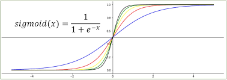

# Neural Network (numpy) 구현해보기

인공신경망의 기본인 neural network를 numpy를 활용하여 구현해보고자 한다.

다음과 같은 인공신경망을 만들고자 한다. 

## L-Layer Neural Network, for binary classification

-이 모델을 기준으로 작성하였다


# Evn


```python
# imports
import argparse
import os
import random
import shutil
import json
import zipfile
import math
import copy
import collections
import re

import matplotlib.pyplot as plt
import pandas as pd
import numpy as np
# import sentencepiece as spm
import tensorflow as tf
import tensorflow.keras.backend as K

from tqdm.notebook import tqdm, trange
```


```python
# 환경 설정
args = {
    # random seed value
    "seed": 1234
}
args = argparse.Namespace(**args)

print(args)
```

    Namespace(seed=1234)


```python
# random seed 설정
random.seed(args.seed)
np.random.seed(args.seed)
tf.random.set_seed(args.seed)
```


```python
# gpu 사용량 확인
!nvidia-smi
```

    NVIDIA-SMI has failed because it couldn't communicate with the NVIDIA driver. Make sure that the latest NVIDIA driver is installed and running.


# Sigmoid

먼저 시그모이드 함수부터 정의하겠습니다. 

- x 값을 -10부터 10까지 1000개로 나눈값을 val_x로 정해줍니다.


```python
val_x = np.linspace(-10, 10, 1000)
val_x
```


    array([-10.        ,  -9.97997998,  -9.95995996,  -9.93993994,
            -9.91991992,  -9.8998999 ,  -9.87987988,  -9.85985986,
            -9.83983984,  -9.81981982,  -9.7997998 ,  -9.77977978,
            -9.75975976,  -9.73973974,  -9.71971972,  -9.6996997 ,
            ***(생략)
             9.77977978,   9.7997998 ,   9.81981982,   9.83983984,
             9.85985986,   9.87987988,   9.8998999 ,   9.91991992,
             9.93993994,   9.95995996,   9.97997998,  10.        ])

- sigmoid_y 는 시그모이드 식을 표현한다
- 


```python
sigmoid_y = 1 / (1 + np.exp(-val_x))
# draw plot
plt.plot(val_x, sigmoid_y)
plt.show()
```

​    


    

- sigmoid 미분한 값

```python
dev_sigmoid_y = 1 / (1 + np.exp(-val_x)) * (1 - 1 / (1 + np.exp(-val_x)))
# draw plot
plt.plot(val_x, dev_sigmoid_y)
plt.show()
```


    

- 함수로 정의해준다.

```python
def sigmoid(x):
    return 1 / (1 + np.exp(-x))
```


```python
def sigmoid_deriv(y):
    return y * (1 - y)
```

# Layer1


```python
x = np.array([
    [0, 0, 1],
    [1, 1, 1],
    [1, 0, 1],
    [0, 1, 1],
])  # (bs, 3)
x
```

- x의 벡터값이 다음과 같이 입력된 것을 확인할 수 있다.


    array([[0, 0, 1],
           [1, 1, 1],
           [1, 0, 1],
           [0, 1, 1]])

- y_true 값 , 즉 결과같인 0,1,1,0 으로 입력해서 알려준다.


```python
y_true = np.array([[0, 1, 1, 0]]).T
y_true  # (bs, 1)
```

- 정해진 y 값 (앞으로 학습해서 궁극적인 정답을 찾을 값)


    array([[0],
           [1],
           [1],
           [0]])

- lr 은 learning rate 값으로 학습하면서 정답에 가까워지기위해 변화시킬 크기(변화량)을 의미한다.
- 너무 크게 설정해줄 경우 그 사이의 정답으로 부터 너무 멀어져서 학습의 정확도가 낮아질 수 있으며
- 너무 작을 경우 학습하는데 시간이 너무 오래걸릴 수 있다.


```python
lr = 0.01
```


```python
Wo = np.random.randn(3, 1)  # (3, 1)
bo = np.zeros((1,))  # (1,)

Wo, bo
```

- neural network의 파라미터인 wo, bo를 정해준다.


    (array([[ 0.47143516],
            [-1.19097569],
            [ 1.43270697]]), array([0.]))


## forward

- 먼저 ho = x * wo + b 이고
  - numpy의 벡터 곱셈인 matmul을 활용해서 h0값을 구해준다.


```python
ho = np.matmul(x, Wo) + bo  # (bs, 3), (3, 1), (1,) -> (bs, 1)
ho
```


    array([[1.43270697],
           [0.71316644],
           [1.90414213],
           [0.24173127]])

- sigmoid를 취해줘서 y의 예측값을 구해준다.


```python
y_pred = sigmoid(ho)  # (bs, 1) -> (bs, 1)
y_pred
```


    array([[0.80732274],
           [0.67110045],
           [0.87035962],
           [0.56014025]])

- MSE = square( y - hat y)


```python
MSE = np.square(y_true - y_pred)  # (bs, 1), (bs, 1) -> (bs, 1)
MSE
```


    array([[0.65177001],
           [0.10817491],
           [0.01680663],
           [0.3137571 ]])


```python
np.mean(MSE)
```


    0.27262716361994604

- 확률값으로 0.5	보다 크면 1로 준다(sigmoid 의 경우 확률값이 0~1 사이이므로 로지스틱 분류를 할 때 유용)


```python
y_pred_class = (y_pred > 0.5).astype(np.float)  # (bs, 1) -> (bs, 1)
y_pred_class
```


    array([[1.],
           [1.],
           [1.],
           [1.]])

- 예측한 y 값고 실제 y 값이 일치하는지 확인해준다.


```python
y_match = (y_true == y_pred_class).astype(np.float)
y_match
```


    array([[0.],
           [1.],
           [1.],
           [0.]])

- accuracy를 확인한다.
- 4개 중에 2개 맞고, 2개 틀렸으므로 accuracy가 0.5임


```python
acc = np.sum(y_match) / max(y_true.shape[0], 1)  # (bs, 1) -> (1,)
acc
```


    0.5


## backward

- 결과값을 가지고 오차를 구해서, 오차값을 앞으로 전달해서 weight 값을 수정하는 backward 방법으로 해보자


- 미분한 MSE 값은 (y_true - y_pred)^1/2를 미분한 것이니까 아래와 같이 미분값이 나온다.


```python
dMSE_dy = -2 * (y_true - y_pred)  # (bs, 1), (bs, 1) -> (bs, 1)
dMSE_dy
```


    array([[ 1.61464548],
           [-0.6577991 ],
           [-0.25928077],
           [ 1.1202805 ]])

- 체인으로 된 미분값을 구하기 위해서 
- dy/dho = deriv(sigmoid(y_pred))
- 


```python
dy_dho = sigmoid_deriv(y_pred)  # (bs, 1) -> (bs, 1)
dy_dho  # (bs, 1)
```


    array([[0.15555273],
           [0.22072464],
           [0.11283376],
           [0.24638315]])


```python
dMSE_dho = dMSE_dy * dy_dho  # (bs, 1), (bs, 1) -> (bs, 1)
dMSE_dho
```


    array([[ 0.25116252],
           [-0.14519247],
           [-0.02925562],
           [ 0.27601824]])


```python
dho_dWo = x  # (bs, 3)
dho_dWo
```


    array([[0, 0, 1],
           [1, 1, 1],
           [1, 0, 1],
           [0, 1, 1]])


```python
dho_dbo = np.array([[1, 1, 1, 1]]).T  # (bs, 1)
dho_dbo
```


    array([[1],
           [1],
           [1],
           [1]])


```python
delta_Wo = np.dot(dho_dWo.T, dMSE_dho)  # (bs, 3).T, (bs, 1) -> (3, 1)
delta_Wo
```


    array([[-0.17444809],
           [ 0.13082577],
           [ 0.35273266]])


```python
delta_bo = np.dot(dho_dbo.T, dMSE_dho)  # (bs, 1).T, (bs, 1) -> (1, 1)
delta_bo
```


    array([[0.35273266]])


```python
Wo -= lr * delta_Wo  # (3, 1), (3, 1) -> (3, 1)
Wo
```


    array([[ 0.47317964],
           [-1.19228395],
           [ 1.42917964]])


```python
bo -= lr * delta_bo.squeeze()  # (1,), (1,) -> (1,)
bo
```


    array([-0.00352733])


## train


```python
lr = 0.01
```


```python
Wo = np.random.randn(3, 1)  # (3, 1)
bo = np.zeros((1,))  # (1,)

Wo, bo
```


    (array([[-2.24268495],
            [ 1.15003572],
            [ 0.99194602]]), array([0.]))


## 실습
- forward & backward를 1000번 반복하면서 학습되는 과정을 확인해 보세요.


```python
losses, acces = [], []
for i in range(1000):
    # forward
    ho = np.dot(x, Wo) + bo  # (bs, 3), (3, 1), (1) -> (bs, 1)
    y_pred = sigmoid(ho)  # (bs, 1) -> (bs, 1)
    # loss
    MSE = np.square(y_true - y_pred)  # (bs, 1), (bs, 1) -> (bs, 1)
    loss = np.mean(MSE)
    losses.append(loss)
    # acc
    y_pred_class = (y_pred > 0.5).astype(np.float)  # (bs, 1) -> (bs, 1)
    y_match = (y_true == y_pred_class).astype(np.float)
    acc = np.sum(y_match) / max(y_true.shape[0], 1)  # (bs, 1) -> (1,)
    acces.append(acc)
    # backward
    dMSE_dy = -2 * (y_true - y_pred)  # (bs, 1), (bs, 1) -> (bs, 1)
    dy_dho = sigmoid_deriv(y_pred)  # (bs, 1) -> (bs, 1)
    dMSE_dho = dMSE_dy * dy_dho  # (bs, 1), (bs, 1) -> (bs, 1)
    dho_dWo = x  # (bs, 3)
    dho_dbo = np.array([[1, 1, 1, 1]]).T  # (bs, 1)
    delta_Wo = np.dot(dho_dWo.T, dMSE_dho)  # (bs, 3).T, (bs, 1) -> (3, 1)
    delta_bo = np.dot(dho_dbo.T, dMSE_dho)  # (bs, 1).T, (bs, 1) -> (1, 1)
    # update weights
    Wo -= lr * delta_Wo  # (3, 1), (3, 1) -> (3, 1)
    bo -= lr * delta_bo.squeeze()  # (1,), (1,) -> (1,)
```


```python
plt.figure(figsize=(12, 4))

plt.subplot(1, 2, 1)
plt.plot(losses, 'b-', label='loss')
plt.xlabel('Epoch')
plt.legend()

plt.subplot(1, 2, 2)
plt.plot(acces, 'g-', label='acc')
plt.xlabel('Epoch')
plt.legend()

plt.show()
```


​    

​    


```python

```
