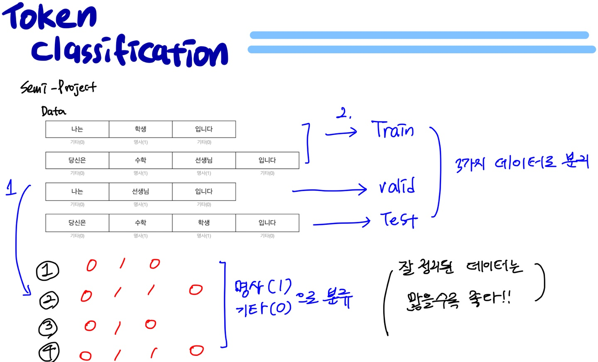
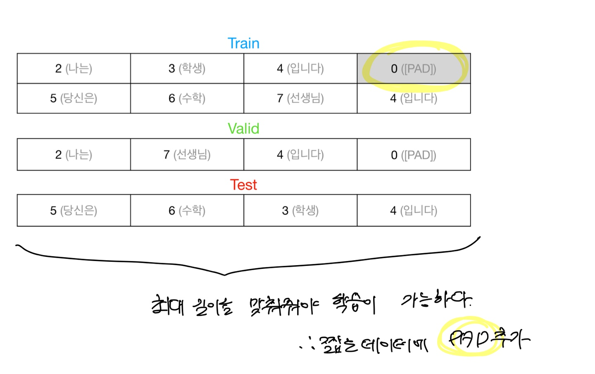
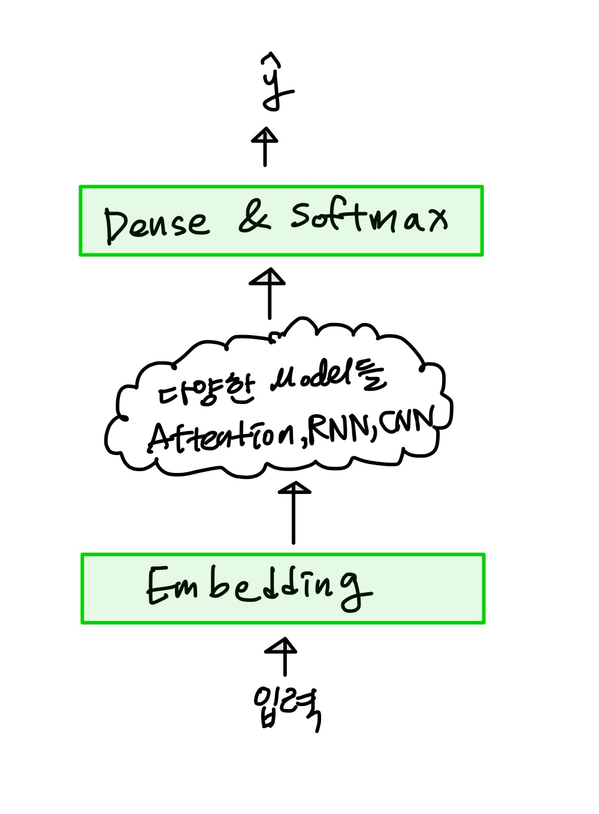
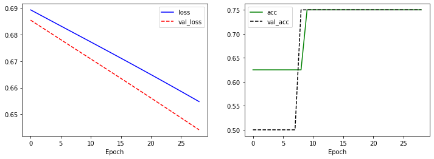
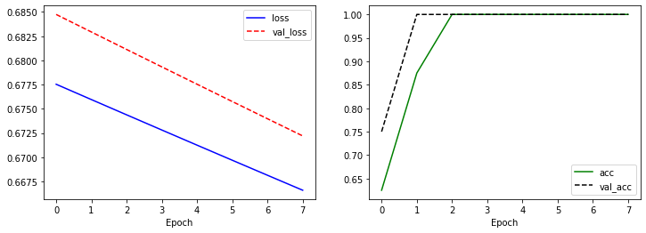
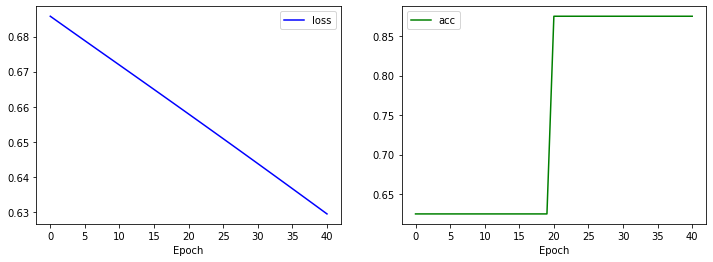
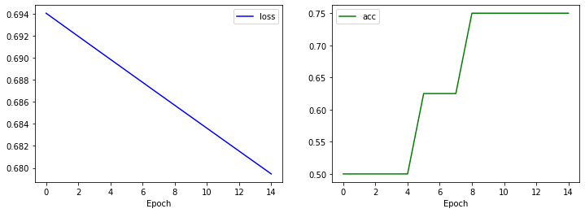

# Token Classification

자연어 처리를 위한 토큰을 구분해보겠습니다.


** 앞으로의 포스팅에서 계속해서 중복되는  Install, Evn 부분은 생략하겠습니다. ** 


# Simple Project

##  Input Data



- 다음과 같이 데이터를 넣어줍니다.


```python
# 입력 문장
sentences = [
    "나는 학생 입니다",
    "당신은 수학 선생님 입니다",
    "나는 선생님 입니다",
    "당신은 수학 학생 입니다"
]

# 출력 정답
targets = [[0, 1, 0],
          [0, 1, 1, 0],
          [0, 1, 0],
          [0, 1, 1, 0]]  # 기타(0), 명사(1)
```


```python
# 라벨링의 id를 설정
id_to_label = {0: "기타", 1: "명사"}
```


```python
#sentences , targets 에서 train 을 나눠줌
train_sentences = sentences[:2]
train_targets = targets[:2]

train_sentences, train_targets
```

- train_sentences, train_targets 확인


    (['나는 학생 입니다', '당신은 수학 선생님 입니다'], [[0, 1, 0], [0, 1, 1, 0]])

- 같은 방법으로 valid_sentences, valid_targets 확인


```python
valid_sentences = sentences[2:3]
valid_targets = targets[2:3]

valid_sentences, valid_targets
```


    (['나는 선생님 입니다'], [[0, 1, 0]])

- 같은 방법으로 test_sentences, test_targets 확인


```python
test_sentences = sentences[3:]
test_targets = targets[3:]

test_sentences, test_targets
```


    (['당신은 수학 학생 입니다'], [[0, 1, 1, 0]])


## Vocabulary

- vocabulary를 뽑아내야한다.
- 


```python
words = []

for line in sentences:
    for w in line.split():
        words.append(w)
words
```


    ['나는',
     '학생',
     '입니다',
     '당신은',
     '수학',
     '선생님',
     '입니다',
     '나는',
     '선생님',
     '입니다',
     '당신은',
     '수학',
     '학생',
     '입니다']

- 중복되는 부분을 제거하고 key만 뽑아내어 리스트 words 생성


```python
list(dict.fromkeys(words))
```


    ['나는', '학생', '입니다', '당신은', '수학', '선생님']


```python
words = list(dict.fromkeys(words))
words
```


    ['나는', '학생', '입니다', '당신은', '수학', '선생님']

- 중복 제거된 word 들을 id 를 정해준다.


```python
word_to_id = {"[PAD]": 0, "[UNK]": 1}
for w in words:
    if w not in word_to_id:
        word_to_id[w] = len(word_to_id)
word_to_id
```


    {'[PAD]': 0,
     '[UNK]': 1,
     '나는': 2,
     '당신은': 5,
     '선생님': 7,
     '수학': 6,
     '입니다': 4,
     '학생': 3}


```python
id_to_word = {_id:w for w, _id in word_to_id.items()}
id_to_word
```


    {0: '[PAD]',
     1: '[UNK]',
     2: '나는',
     3: '학생',
     4: '입니다',
     5: '당신은',
     6: '수학',
     7: '선생님'}


```python
args.n_vocab = len(word_to_id)
args
```


    Namespace(n_vocab=8, seed=1234)


## Train, Valid, Test 데이터 생성


```python
[0] * 10
```


    [0, 0, 0, 0, 0, 0, 0, 0, 0, 0]




```python
def make_data(sentences, targets, n_seq=4):
    tokens, labels = [], []
		# 최대길이에 맞춰서 모든 데이터들이 같은 기이를 갖을 수 있도록 pad를 해준다.
    for sentence, target in zip(sentences, targets):
        _token = [word_to_id[w] for w in sentence.split()]
        _token = _token[:n_seq]
        _token += [0] * (n_seq - len(_token))
        tokens.append(_token)

        _label = target
        _label = _label[:n_seq]
        _label += [0] * (n_seq - len(_label))
        print(_label)
        labels.append(_label)

    tokens = np.array(tokens)
    labels = np.array(labels)
    
    return tokens, labels
```


```python
train_tokens, train_labels = make_data(train_sentences, train_targets, n_seq=4)
train_tokens, train_labels
```

    (array([[2, 3, 4, 0],
            [5, 6, 7, 4]]), array([[0, 1, 0, 0],
            [0, 1, 1, 0]]))


```python
valid_tokens, valid_labels = make_data(valid_sentences, valid_targets)
valid_tokens, valid_labels
```

    (array([[2, 7, 4, 0]]), array([[0, 1, 0, 0]]))


```python
test_tokens, test_labels = make_data(test_sentences, test_targets)
test_tokens, test_labels
```

    [0, 1, 1, 0]

    (array([[5, 6, 3, 4]]), array([[0, 1, 1, 0]]))

- 이제 모델링에 필요한 데이터 들이 생성되었다.

## Modeling

- 모델링을 하면서 필요한 파라미터  n_vocab, d_model, n_seq, n_out 을 args값에 입력


```python
args.n_vocab = len(word_to_id)
args.d_model = 3
args.n_seq = 4
args.n_out = 2
args
```


    Namespace(d_model=3, n_out=2, n_seq=4, n_vocab=8, seed=1234)

### Tutorial




```python
train_tokens
```


    array([[2, 3, 4, 0],
           [5, 6, 7, 4]])

- Embedding 단계


```python
# 입력 단어를 vector로 변환
embedding = tf.keras.layers.Embedding(args.n_vocab, args.d_model)
hidden = embedding(train_tokens)
hidden
```


    <tf.Tensor: shape=(2, 4, 3), dtype=float32, numpy=
    array([[[ 0.00072207, -0.01411822,  0.02788493],
            [ 0.00853021,  0.02688133, -0.00167429],
            [ 0.00873896, -0.04772998, -0.00643448],
            [ 0.00380393, -0.01353813,  0.00816301]],
    
           [[ 0.04782395,  0.04810704, -0.03535189],
            [ 0.04945729,  0.02813626, -0.02798697],
            [-0.00110071,  0.0133124 ,  0.00637371],
            [ 0.00873896, -0.04772998, -0.00643448]]], dtype=float32)>

- 학습된 weight 값들의 embedding


```python
# embedding weight
weight = embedding.get_weights()[0]
weight
```


    array([[ 0.00380393, -0.01353813,  0.00816301],
           [-0.02561716, -0.00696643,  0.04061912],
           [ 0.00072207, -0.01411822,  0.02788493],
           [ 0.00853021,  0.02688133, -0.00167429],
           [ 0.00873896, -0.04772998, -0.00643448],
           [ 0.04782395,  0.04810704, -0.03535189],
           [ 0.04945729,  0.02813626, -0.02798697],
           [-0.00110071,  0.0133124 ,  0.00637371]], dtype=float32)


```python
# numpy를 이용해서 직접 조회 (두 결과값 비교)
weight[train_tokens], hidden
```


    (array([[[ 0.00072207, -0.01411822,  0.02788493],
             [ 0.00853021,  0.02688133, -0.00167429],
             [ 0.00873896, -0.04772998, -0.00643448],
             [ 0.00380393, -0.01353813,  0.00816301]],
     
            [[ 0.04782395,  0.04810704, -0.03535189],
             [ 0.04945729,  0.02813626, -0.02798697],
             [-0.00110071,  0.0133124 ,  0.00637371],
             [ 0.00873896, -0.04772998, -0.00643448]]], dtype=float32),
     <tf.Tensor: shape=(2, 4, 3), dtype=float32, numpy=

- 예측 단계


```python
# RNN, CNN, Attention, Linear ....
```


```python
# 단어의 vector를 이용해서 기타(0), 명사(1) 확률값 예측
linear = tf.keras.layers.Dense(args.n_out)
logits = linear(hidden)
logits
```


    <tf.Tensor: shape=(2, 4, 2), dtype=float32, numpy=
    array([[[-0.01482825, -0.01710289],
            [ 0.00605429, -0.01693781],
            [-0.01652409,  0.01878998],
            [-0.00876601, -0.00381209]],
    
           [[ 0.00994926, -0.02986849],
            [ 0.00021267, -0.02855376],
            [ 0.00245969, -0.01000892],
            [-0.01652409,  0.01878998]]], dtype=float32)>


```python
# dense의 wieght, bias
weight, bias = linear.get_weights()
weight, bias
```


    (array([[-0.38260674, -0.7915673 ],
            [ 0.3243599 , -0.42937422],
            [-0.35763377, -0.810234  ]], dtype=float32),
     array([0., 0.], dtype=float32))


```python
# numpy를 이용한 Wx + b
logits = np.matmul(hidden, weight) + bias
logits
```


    array([[[-0.01482825, -0.01710289],
            [ 0.00605429, -0.01693781],
            [-0.01652409,  0.01878998],
            [-0.00876601, -0.00381209]],
    
           [[ 0.00994926, -0.02986849],
            [ 0.00021267, -0.02855376],
            [ 0.00245969, -0.01000892],
            [-0.01652409,  0.01878998]]], dtype=float32)

- softmax 단계


```python
# softmax 계산을 위한 준비 exp(x') / sum(exp(x))
numerator = np.exp(logits)
denominator = np.sum(numerator, axis=2, keepdims=True)
numerator, denominator
```


    (array([[[0.98528117, 0.98304254],
             [1.0060728 , 0.9832049 ],
             [0.9836117 , 1.0189676 ],
             [0.9912722 , 0.9961952 ]],
     
            [[1.0099989 , 0.9705732 ],
             [1.0002127 , 0.97185   ],
             [1.0024627 , 0.990041  ],
             [0.9836117 , 1.0189676 ]]], dtype=float32), array([[[1.9683237],
             [1.9892776],
             [2.0025792],
             [1.9874674]],
     
            [[1.9805721],
             [1.9720626],
             [1.9925038],
             [2.0025792]]], dtype=float32))


```python
# 두 결과값 비교
probs = numerator / denominator
probs, tf.nn.softmax(logits, axis=-1)
```


    (array([[[0.5005687 , 0.49943134],
             [0.5057478 , 0.49425223],
             [0.49117243, 0.5088276 ],
             [0.4987615 , 0.5012385 ]],
     
            [[0.50995314, 0.4900469 ],
             [0.5071911 , 0.49280888],
             [0.50311714, 0.4968829 ],
             [0.49117243, 0.5088276 ]]], dtype=float32),
     <tf.Tensor: shape=(2, 4, 2), dtype=float32, numpy=
     array([[[0.5005687 , 0.49943137],
             [0.5057478 , 0.49425223],
             [0.49117234, 0.50882757],
             [0.49876153, 0.50123847]],
     
            [[0.50995314, 0.4900469 ],
             [0.5071911 , 0.4928089 ],
             [0.50311714, 0.49688292],
             [0.49117234, 0.50882757]]], dtype=float32)>)


### 실습
- 아래 class를 완성하세요.


```python
class TokenClassifier(tf.keras.Model):
    """
    TokenClassifier Class
    """
    def __init__(self, args, name='token_classifier'):
        """
        생성자
        :param args: Args 객체
        :param name: layer name
        """
        super().__init__(name=name)

        self.embedding = tf.keras.layers.Embedding(args.n_vocab, args.d_model)
        self.linear = tf.keras.layers.Dense(args.n_out)

    def call(self, inputs, training=False):
        """
        layer 실행
        :param inputs: tokens
        :param training: training flag
        :return logits: tokens 예측 결과
        """
        tokens = inputs

        hidden = self.embedding(tokens)
        # RNN, CNN, Attetion
        logits = self.linear(hidden)

        return logits
```


```python
# 모델 생성
model = TokenClassifier(args)
```


```python
logits = model(train_tokens[:4])
logits, train_labels[:4]
```


    (<tf.Tensor: shape=(2, 4, 2), dtype=float32, numpy=
     array([[[-0.00640416,  0.02394772],
             [-0.04285834, -0.01539525],
             [-0.01155909,  0.00892094],
             [-0.02786953,  0.01314356]],
     
            [[-0.0067608 , -0.0161035 ],
             [ 0.05980125,  0.01424708],
             [-0.04207917, -0.02727687],
             [-0.01155909,  0.00892094]]], dtype=float32)>, array([[0, 1, 0, 0],
            [0, 1, 1, 0]]))


```python
y_pred = tf.nn.softmax(logits, axis=-1)
y_true = tf.one_hot(train_labels[:4], 2)

y_pred, y_true
```


    (<tf.Tensor: shape=(2, 4, 2), dtype=float32, numpy=
     array([[[0.4924126 , 0.5075874 ],
             [0.49313465, 0.5068653 ],
             [0.4948802 , 0.50511986],
             [0.48974818, 0.5102519 ]],
     
            [[0.50233567, 0.49766433],
             [0.5113866 , 0.48861346],
             [0.4962995 , 0.5037005 ],
             [0.4948802 , 0.50511986]]], dtype=float32)>,
     <tf.Tensor: shape=(2, 4, 2), dtype=float32, numpy=
     array([[[1., 0.],
             [0., 1.],
             [1., 0.],
             [1., 0.]],
     
            [[1., 0.],
             [0., 1.],
             [0., 1.],
             [1., 0.]]], dtype=float32)>)


```python
y_pred_nl = np.log(1 / y_pred)
y_pred_nl, -np.log(y_pred)
```


    (array([[[0.70843834, 0.67808646],
             [0.706973  , 0.67950994],
             [0.7034396 , 0.6829595 ],
             [0.7138639 , 0.6728508 ]],
     
            [[0.6884867 , 0.6978295 ],
             [0.67062944, 0.71618354],
             [0.7005757 , 0.68577343],
             [0.7034396 , 0.6829595 ]]], dtype=float32),
     array([[[0.7084383 , 0.6780864 ],
             [0.706973  , 0.67950994],
             [0.7034396 , 0.68295956],
             [0.71386397, 0.6728508 ]],
     
            [[0.6884867 , 0.6978295 ],
             [0.6706295 , 0.7161836 ],
             [0.7005757 , 0.68577343],
             [0.7034396 , 0.68295956]]], dtype=float32))


```python
np.mean(np.sum(y_true * y_pred_nl, axis=-1))
```


    0.6998919


```python
tf.keras.losses.CategoricalCrossentropy()(y_true, y_pred)
```


    <tf.Tensor: shape=(), dtype=float32, numpy=0.6998919>


```python
tf.keras.losses.CategoricalCrossentropy(from_logits=True)(y_true, logits)
```


    <tf.Tensor: shape=(), dtype=float32, numpy=0.6998919>


```python
tf.keras.losses.SparseCategoricalCrossentropy()(train_labels, y_pred)
```


    <tf.Tensor: shape=(), dtype=float32, numpy=0.6998919>


```python
tf.keras.losses.SparseCategoricalCrossentropy(from_logits=True)(train_labels, logits)
```


    <tf.Tensor: shape=(), dtype=float32, numpy=0.6998919>


## Train


```python
# 모델 생성
model = TokenClassifier(args)
```


```python
# 모델 loss, optimizer, metric 정의
loss_fn = tf.keras.losses.SparseCategoricalCrossentropy(from_logits=True)
optimizer = tf.keras.optimizers.Adam()
accuracy = tf.keras.metrics.SparseCategoricalAccuracy(name="acc")
model.compile(loss=loss_fn, optimizer=optimizer, metrics=[accuracy])
```


```python
early_stopping = tf.keras.callbacks.EarlyStopping(monitor='val_acc', patience=20)
save_weights = tf.keras.callbacks.ModelCheckpoint("token_class.hdf5",
                                                  monitor='val_acc',
                                                  verbose=1,
                                                  save_best_only=True,
                                                  mode="max",
                                                  save_freq="epoch",
                                                  save_weights_only=True)
csv_logger = tf.keras.callbacks.CSVLogger("token_class.csv")
```


```python
EPOCHS, BATCHS = 100, 256

train_steps = int(np.ceil(len(train_tokens) / BATCHS)) * EPOCHS
train_steps
```


    100


```python
# 모델 학습
history = model.fit(train_tokens, train_labels,
                    epochs=EPOCHS,
                    batch_size=BATCHS,
                    validation_data=(valid_tokens, valid_labels),
                    callbacks=[early_stopping, save_weights, csv_logger])
```


```python
plt.figure(figsize=(12, 4))

plt.subplot(1, 2, 1)
plt.plot(history.history['loss'], 'b-', label='loss')
plt.plot(history.history['val_loss'], 'r--', label='val_loss')
plt.xlabel('Epoch')
plt.legend()

plt.subplot(1, 2, 2)
plt.plot(history.history['acc'], 'g-', label='acc')
plt.plot(history.history['val_acc'], 'k--', label='val_acc')
plt.xlabel('Epoch')
plt.legend()

plt.show()
```


​    

​    


## Train (GradientTape)


```python
# 모델 생성
model = TokenClassifier(args)
```


```python
# 모델 loss, optimizer, metric 정의
optimizer = tf.keras.optimizers.Adam()

loss_fn = tf.keras.losses.SparseCategoricalCrossentropy(from_logits=True)

train_loss = tf.keras.metrics.Mean()
train_acc = tf.keras.metrics.SparseCategoricalAccuracy()

test_loss = tf.keras.metrics.Mean()
test_acc = tf.keras.metrics.SparseCategoricalAccuracy()
```


```python
@tf.function
def train_step(tokens, labels):
    with tf.GradientTape() as tape:
        y_pred = model(tokens, training=True)
        loss = loss_fn(labels, y_pred)
    gradients = tape.gradient(loss, model.trainable_variables)
    optimizer.apply_gradients(zip(gradients, model.trainable_variables))

    train_loss(loss)
    train_acc(labels, y_pred)
```


```python
@tf.function
def test_step(tokens, labels):
    y_pred = model(tokens)
    loss = loss_fn(labels, y_pred)

    test_loss(loss)
    test_acc(labels, y_pred)
```


```python
EPOCHS, BATCHS = 100, 256

train_steps = int(np.ceil(len(train_tokens) / BATCHS)) * EPOCHS
train_steps
```


    100


```python
train_dataset = tf.data.Dataset.from_tensor_slices((train_tokens, train_labels)).shuffle(100000).batch(BATCHS)
valid_dataset = tf.data.Dataset.from_tensor_slices((valid_tokens, valid_labels)).batch(BATCHS)
```


```python
for tokens, labels in train_dataset:
    print(tokens)
    print(labels)
```

    tf.Tensor(
    [[2 3 4 0]
     [5 6 7 4]], shape=(2, 4), dtype=int64)
    tf.Tensor(
    [[0 1 0 0]
     [0 1 1 0]], shape=(2, 4), dtype=int64)


```python
history = {'loss': [], 'acc': [], 'val_loss': [], 'val_acc': []}
n_step, best_acc, patience = 0, 0, 0

p_bar = trange(train_steps)
for epoch in range(EPOCHS):
    train_loss.reset_states()
    train_acc.reset_states()
    test_loss.reset_state()
    test_acc.reset_state()

    # train
    for tokens, labels in train_dataset:
        n_step += 1
        train_step(tokens, labels)
        p_bar.update(1)
        if n_step % 10 == 0:
            p_bar.set_description(f'train epoch: {epoch + 1:2d}, loss: {train_loss.result().numpy():.4f}, acc: {train_acc.result().numpy():.4f}')
    p_bar.set_description(f'train epoch: {epoch + 1:2d}, loss: {train_loss.result().numpy():.4f}, acc: {train_acc.result().numpy():.4f}')

    # valid
    for tokens, labels in valid_dataset:
        test_step(tokens, labels)
    p_bar.set_description(f'valid epoch: {epoch + 1:2d}, loss: {train_loss.result().numpy():.4f}, acc: {train_acc.result().numpy():.4f}')

    history['loss'].append(train_loss.result().numpy())
    history['acc'].append(train_acc.result().numpy())
    history['val_loss'].append(test_loss.result().numpy())
    history['val_acc'].append(test_acc.result().numpy())

    curr_acc = test_acc.result().numpy()
    if best_acc < curr_acc:
        model.save_weights("token_class.hdf5")
        print(f'epoch: {epoch + 1:2d} prev: {best_acc:.4f}, best: {curr_acc:.4f} improved!! save weights')
        best_acc = curr_acc
        patience = 0
    else:
        print(f'epoch: {epoch + 1:2d} curr: {curr_acc:.4f}, best: {best_acc:.4f} not improved!!')
        patience += 1
        if patience > 5:
            break
```


      0%|          | 0/100 [00:00<?, ?it/s]


    epoch:  1 prev: 0.0000, best: 0.7500 improved!! save weights
    epoch:  2 prev: 0.7500, best: 1.0000 improved!! save weights
    epoch:  3 curr: 1.0000, best: 1.0000 not improved!!
    epoch:  4 curr: 1.0000, best: 1.0000 not improved!!
    epoch:  5 curr: 1.0000, best: 1.0000 not improved!!
    epoch:  6 curr: 1.0000, best: 1.0000 not improved!!
    epoch:  7 curr: 1.0000, best: 1.0000 not improved!!
    epoch:  8 curr: 1.0000, best: 1.0000 not improved!!


```python
plt.figure(figsize=(12, 4))

plt.subplot(1, 2, 1)
plt.plot(history['loss'], 'b-', label='loss')
plt.plot(history['val_loss'], 'r--', label='val_loss')
plt.xlabel('Epoch')
plt.legend()

plt.subplot(1, 2, 2)
plt.plot(history['acc'], 'g-', label='acc')
plt.plot(history['val_acc'], 'k--', label='val_acc')
plt.xlabel('Epoch')
plt.legend()

plt.show()
```


​    

​    


## 평가


```python
# 모델 생성
model = TokenClassifier(args)
# 모델 초기화
model(np.array([[0]]))
# 모델 weight load
model.load_weights("token_class.hdf5")
```


```python
# 모델 loss, optimizer, metric 정의
loss_fn = tf.keras.losses.SparseCategoricalCrossentropy(from_logits=True)
optimizer = tf.keras.optimizers.Adam()
accuracy = tf.keras.metrics.SparseCategoricalAccuracy(name="acc")
model.compile(loss=loss_fn, optimizer=optimizer, metrics=[accuracy])
```


```python
# 모델 평가
model.evaluate(test_tokens, test_labels)
```

    1/1 [==============================] - 0s 125ms/step - loss: 0.6658 - acc: 1.0000


    [0.6658236980438232, 1.0]


## 배포


```python
# 모델 생성
model = TokenClassifier(args)
# 모델 초기화
model(np.array([[0]]))
# 모델 weight load
model.load_weights("token_class.hdf5")
```


```python
# 추론할 입력
string = '수학 당신은 선생님 입니다'
```


```python
# 입력을 숫자로 변경
infer_token = [word_to_id[word] for word in string.split()]
infer_token
```


    [6, 5, 7, 4]


```python
# numpy array 변환
infer_tokens = np.array([infer_token])
infer_tokens
```


    array([[6, 5, 7, 4]])


```python
# 기타(0), 명사(1) 추론
y_preds = model.predict(infer_tokens)
y_preds
```


    array([[[-0.03813983,  0.03271784],
            [ 0.01870277, -0.06811523],
            [-0.02058577, -0.0137619 ],
            [ 0.00375336, -0.00231887]]], dtype=float32)


```python
# 확률의 max 값을 추론 값으로 결정
y_pred_class = np.argmax(y_preds, axis=2)
y_pred_class
```


    array([[1, 0, 1, 0]])


```python
# 각 예측 값에 대한 label string
for row in y_pred_class:
    for val in row:
        print(val, ':', id_to_label[val])
```

    1 : 명사
    0 : 기타
    1 : 명사
    0 : 기타


# 실습
- 아래 입력 문장과 출력 정답을 이용해 간단한 프로젝트를 구성해 보세요.

## Data


```python
# 입력 문장
sentences = [
    "이것은 책상 입니다",
    "저것은 책상 의자 입니다",
]

# 출력 정답
targets = [[0, 1, 0],
          [0, 0, 1, 0]]  # 기타(0), 대상(1)
```

## Vocabulary


```python
words = []
for line in sentences:
    words.extend(line.strip().split())

words = list(dict.fromkeys(words))

word_to_id = {"[PAD]": 0, "[UNK]": 1}
for w in words:
    if w not in word_to_id:
        word_to_id[w] = len(word_to_id)

id_to_word = {_id:w for w, _id in word_to_id.items()}

word_to_id, id_to_word
```


    ({'[PAD]': 0, '[UNK]': 1, '의자': 6, '이것은': 2, '입니다': 4, '저것은': 5, '책상': 3},
     {0: '[PAD]', 1: '[UNK]', 2: '이것은', 3: '책상', 4: '입니다', 5: '저것은', 6: '의자'})


## Train, Valid, Test 데이터 생성


```python
def make_data(sentences, targets, n_seq=4):
    tokens, labels = [], []

    for sentence, target in zip(sentences, targets):
        _token = [word_to_id[w] for w in sentence.split()]
        _token = _token[:n_seq]
        _token += [0] * (n_seq - len(_token))
        tokens.append(_token)

        _label = target
        _label = _label[:n_seq]
        _label += [0] * (n_seq - len(_label))
        labels.append(_label)

    tokens = np.array(tokens)
    labels = np.array(labels)
    
    return tokens, labels
```


```python
train_tokens, train_labels = make_data(sentences, targets, n_seq=4)
train_tokens, train_labels
```


    (array([[2, 3, 4, 0],
            [5, 3, 6, 4]]), array([[0, 1, 0, 0],
            [0, 0, 1, 0]]))


## Modeling


```python
args.n_vocab = len(word_to_id)
args.d_model = 3
args.n_seq = 4
args.n_out = 2
args
```


    Namespace(d_model=3, n_out=2, n_seq=4, n_vocab=7, seed=1234)


```python
class TokenClassifier(tf.keras.Model):
    """
    TokenClassifier Class
    """
    def __init__(self, args, name='token_classifier'):
        """
        생성자
        :param args: Args 객체
        :param name: layer name
        """
        super().__init__(name=name)

        self.embedding = tf.keras.layers.Embedding(args.n_vocab, args.d_model)
        self.linear = tf.keras.layers.Dense(args.n_out)

    def call(self, inputs, training=False):
        """
        layer 실행
        :param inputs: tokens
        :param training: training flag
        :return logits: tokens 예측 결과
        """
        tokens = inputs

        hidden = self.embedding(tokens)
        # RNN, CNN, Attetion
        logits = self.linear(hidden)

        return logits
```

## Train


```python
# 모델 생성
model = TokenClassifier(args)
```


```python
# 모델 loss, optimizer, metric 정의
loss_fn = tf.keras.losses.SparseCategoricalCrossentropy(from_logits=True)
optimizer = tf.keras.optimizers.Adam()
accuracy = tf.keras.metrics.SparseCategoricalAccuracy(name="acc")
model.compile(loss=loss_fn, optimizer=optimizer, metrics=[accuracy])
```


```python
early_stopping = tf.keras.callbacks.EarlyStopping(monitor='acc', patience=20)
save_weights = tf.keras.callbacks.ModelCheckpoint("token_class.hdf5",
                                                  monitor='acc',
                                                  verbose=1,
                                                  save_best_only=True,
                                                  mode="max",
                                                  save_freq="epoch",
                                                  save_weights_only=True)
csv_logger = tf.keras.callbacks.CSVLogger("token_class.csv")
```


```python
EPOCHS, BATCHS = 100, 256

train_steps = int(np.ceil(len(train_tokens) / BATCHS)) * EPOCHS
train_steps
```


    100


```python
# 모델 학습
history = model.fit(train_tokens, train_labels,
                    epochs=EPOCHS,
                    batch_size=BATCHS,
                    # validation_data=(train_tokens, train_labels),
                    callbacks=[early_stopping, save_weights, csv_logger])
```

    Epoch 1/100
    1/1 [==============================] - 1s 592ms/step - loss: 0.6858 - acc: 0.6250 - val_loss: 0.6844 - val_acc: 0.6250
    
    Epoch 00001: acc improved from -inf to 0.62500, saving model to token_class.hdf5
    Epoch 2/100
    1/1 [==============================] - 0s 22ms/step - loss: 0.6844 - acc: 0.6250 - val_loss: 0.6830 - val_acc: 0.6250
    
    Epoch 00002: acc did not improve from 0.62500
    Epoch 3/100
    1/1 [==============================] - 0s 22ms/step - loss: 0.6830 - acc: 0.6250 - val_loss: 0.6816 - val_acc: 0.6250
    
    Epoch 00003: acc did not improve from 0.62500
    Epoch 4/100
    1/1 [==============================] - 0s 27ms/step - loss: 0.6816 - acc: 0.6250 - val_loss: 0.6802 - val_acc: 0.6250
    
    Epoch 00004: acc did not improve from 0.62500
    Epoch 5/100
    1/1 [==============================] - 0s 31ms/step - loss: 0.6802 - acc: 0.6250 - val_loss: 0.6788 - val_acc: 0.6250
    
    Epoch 00005: acc did not improve from 0.62500
    Epoch 6/100
    1/1 [==============================] - 0s 22ms/step - loss: 0.6788 - acc: 0.6250 - val_loss: 0.6774 - val_acc: 0.6250
    
    Epoch 00006: acc did not improve from 0.62500
    Epoch 7/100
    1/1 [==============================] - 0s 21ms/step - loss: 0.6774 - acc: 0.6250 - val_loss: 0.6760 - val_acc: 0.6250
    
    Epoch 00007: acc did not improve from 0.62500
    Epoch 8/100
    1/1 [==============================] - 0s 22ms/step - loss: 0.6760 - acc: 0.6250 - val_loss: 0.6746 - val_acc: 0.6250
    
    Epoch 00008: acc did not improve from 0.62500
    Epoch 9/100
    1/1 [==============================] - 0s 22ms/step - loss: 0.6746 - acc: 0.6250 - val_loss: 0.6733 - val_acc: 0.6250
    
    Epoch 00009: acc did not improve from 0.62500
    Epoch 10/100
    1/1 [==============================] - 0s 24ms/step - loss: 0.6733 - acc: 0.6250 - val_loss: 0.6719 - val_acc: 0.6250
    
    Epoch 00010: acc did not improve from 0.62500
    Epoch 11/100
    1/1 [==============================] - 0s 21ms/step - loss: 0.6719 - acc: 0.6250 - val_loss: 0.6705 - val_acc: 0.6250
    
    Epoch 00011: acc did not improve from 0.62500
    Epoch 12/100
    1/1 [==============================] - 0s 22ms/step - loss: 0.6705 - acc: 0.6250 - val_loss: 0.6691 - val_acc: 0.6250
    
    Epoch 00012: acc did not improve from 0.62500
    Epoch 13/100
    1/1 [==============================] - 0s 21ms/step - loss: 0.6691 - acc: 0.6250 - val_loss: 0.6677 - val_acc: 0.6250
    
    Epoch 00013: acc did not improve from 0.62500
    Epoch 14/100
    1/1 [==============================] - 0s 23ms/step - loss: 0.6677 - acc: 0.6250 - val_loss: 0.6663 - val_acc: 0.6250
    
    Epoch 00014: acc did not improve from 0.62500
    Epoch 15/100
    1/1 [==============================] - 0s 21ms/step - loss: 0.6663 - acc: 0.6250 - val_loss: 0.6649 - val_acc: 0.6250
    
    Epoch 00015: acc did not improve from 0.62500
    Epoch 16/100
    1/1 [==============================] - 0s 22ms/step - loss: 0.6649 - acc: 0.6250 - val_loss: 0.6635 - val_acc: 0.6250
    
    Epoch 00016: acc did not improve from 0.62500
    Epoch 17/100
    1/1 [==============================] - 0s 24ms/step - loss: 0.6635 - acc: 0.6250 - val_loss: 0.6621 - val_acc: 0.6250
    
    Epoch 00017: acc did not improve from 0.62500
    Epoch 18/100
    1/1 [==============================] - 0s 34ms/step - loss: 0.6621 - acc: 0.6250 - val_loss: 0.6608 - val_acc: 0.6250
    
    Epoch 00018: acc did not improve from 0.62500
    Epoch 19/100
    1/1 [==============================] - 0s 24ms/step - loss: 0.6608 - acc: 0.6250 - val_loss: 0.6594 - val_acc: 0.6250
    
    Epoch 00019: acc did not improve from 0.62500
    Epoch 20/100
    1/1 [==============================] - 0s 28ms/step - loss: 0.6594 - acc: 0.6250 - val_loss: 0.6580 - val_acc: 0.8750
    
    Epoch 00020: acc did not improve from 0.62500
    Epoch 21/100
    1/1 [==============================] - 0s 22ms/step - loss: 0.6580 - acc: 0.8750 - val_loss: 0.6566 - val_acc: 0.8750
    
    Epoch 00021: acc improved from 0.62500 to 0.87500, saving model to token_class.hdf5
    Epoch 22/100
    1/1 [==============================] - 0s 28ms/step - loss: 0.6566 - acc: 0.8750 - val_loss: 0.6551 - val_acc: 0.8750
    
    Epoch 00022: acc did not improve from 0.87500
    Epoch 23/100
    1/1 [==============================] - 0s 23ms/step - loss: 0.6551 - acc: 0.8750 - val_loss: 0.6537 - val_acc: 0.8750
    
    Epoch 00023: acc did not improve from 0.87500
    Epoch 24/100
    1/1 [==============================] - 0s 25ms/step - loss: 0.6537 - acc: 0.8750 - val_loss: 0.6523 - val_acc: 0.8750
    
    Epoch 00024: acc did not improve from 0.87500
    Epoch 25/100
    1/1 [==============================] - 0s 48ms/step - loss: 0.6523 - acc: 0.8750 - val_loss: 0.6509 - val_acc: 0.8750
    
    Epoch 00025: acc did not improve from 0.87500
    Epoch 26/100
    1/1 [==============================] - 0s 32ms/step - loss: 0.6509 - acc: 0.8750 - val_loss: 0.6495 - val_acc: 0.8750
    
    Epoch 00026: acc did not improve from 0.87500
    Epoch 27/100
    1/1 [==============================] - 0s 26ms/step - loss: 0.6495 - acc: 0.8750 - val_loss: 0.6481 - val_acc: 0.8750
    
    Epoch 00027: acc did not improve from 0.87500
    Epoch 28/100
    1/1 [==============================] - 0s 24ms/step - loss: 0.6481 - acc: 0.8750 - val_loss: 0.6467 - val_acc: 0.8750
    
    Epoch 00028: acc did not improve from 0.87500
    Epoch 29/100
    1/1 [==============================] - 0s 23ms/step - loss: 0.6467 - acc: 0.8750 - val_loss: 0.6453 - val_acc: 0.8750
    
    Epoch 00029: acc did not improve from 0.87500
    Epoch 30/100
    1/1 [==============================] - 0s 24ms/step - loss: 0.6453 - acc: 0.8750 - val_loss: 0.6438 - val_acc: 0.8750
    
    Epoch 00030: acc did not improve from 0.87500
    Epoch 31/100
    1/1 [==============================] - 0s 21ms/step - loss: 0.6438 - acc: 0.8750 - val_loss: 0.6424 - val_acc: 0.8750
    
    Epoch 00031: acc did not improve from 0.87500
    Epoch 32/100
    1/1 [==============================] - 0s 23ms/step - loss: 0.6424 - acc: 0.8750 - val_loss: 0.6410 - val_acc: 0.8750
    
    Epoch 00032: acc did not improve from 0.87500
    Epoch 33/100
    1/1 [==============================] - 0s 23ms/step - loss: 0.6410 - acc: 0.8750 - val_loss: 0.6396 - val_acc: 0.8750
    
    Epoch 00033: acc did not improve from 0.87500
    Epoch 34/100
    1/1 [==============================] - 0s 23ms/step - loss: 0.6396 - acc: 0.8750 - val_loss: 0.6381 - val_acc: 0.8750
    
    Epoch 00034: acc did not improve from 0.87500
    Epoch 35/100
    1/1 [==============================] - 0s 25ms/step - loss: 0.6381 - acc: 0.8750 - val_loss: 0.6367 - val_acc: 0.8750
    
    Epoch 00035: acc did not improve from 0.87500
    Epoch 36/100
    1/1 [==============================] - 0s 48ms/step - loss: 0.6367 - acc: 0.8750 - val_loss: 0.6353 - val_acc: 0.8750
    
    Epoch 00036: acc did not improve from 0.87500
    Epoch 37/100
    1/1 [==============================] - 0s 25ms/step - loss: 0.6353 - acc: 0.8750 - val_loss: 0.6339 - val_acc: 0.8750
    
    Epoch 00037: acc did not improve from 0.87500
    Epoch 38/100
    1/1 [==============================] - 0s 21ms/step - loss: 0.6339 - acc: 0.8750 - val_loss: 0.6324 - val_acc: 0.8750
    
    Epoch 00038: acc did not improve from 0.87500
    Epoch 39/100
    1/1 [==============================] - 0s 26ms/step - loss: 0.6324 - acc: 0.8750 - val_loss: 0.6310 - val_acc: 0.8750
    
    Epoch 00039: acc did not improve from 0.87500
    Epoch 40/100
    1/1 [==============================] - 0s 23ms/step - loss: 0.6310 - acc: 0.8750 - val_loss: 0.6295 - val_acc: 0.8750
    
    Epoch 00040: acc did not improve from 0.87500
    Epoch 41/100
    1/1 [==============================] - 0s 30ms/step - loss: 0.6295 - acc: 0.8750 - val_loss: 0.6281 - val_acc: 0.8750
    
    Epoch 00041: acc did not improve from 0.87500


```python
plt.figure(figsize=(12, 4))

plt.subplot(1, 2, 1)
plt.plot(history.history['loss'], 'b-', label='loss')
plt.xlabel('Epoch')
plt.legend()

plt.subplot(1, 2, 2)
plt.plot(history.history['acc'], 'g-', label='acc')
plt.xlabel('Epoch')
plt.legend()

plt.show()
```


​    

​    


## Train (GradientTape)


```python
# 모델 생성
model = TokenClassifier(args)
```


```python
# 모델 loss, optimizer, metric 정의
optimizer = tf.keras.optimizers.Adam()

loss_fn = tf.keras.losses.SparseCategoricalCrossentropy(from_logits=True)

train_loss = tf.keras.metrics.Mean()
train_acc = tf.keras.metrics.SparseCategoricalAccuracy()

test_loss = tf.keras.metrics.Mean()
test_acc = tf.keras.metrics.SparseCategoricalAccuracy()
```


```python
@tf.function
def train_step(tokens, labels):
    with tf.GradientTape() as tape:
        y_pred = model(tokens, training=True)
        loss = loss_fn(labels, y_pred)
    gradients = tape.gradient(loss, model.trainable_variables)
    optimizer.apply_gradients(zip(gradients, model.trainable_variables))

    train_loss(loss)
    train_acc(labels, y_pred)
```


```python
@tf.function
def test_step(tokens, labels):
    y_pred = model(tokens)
    loss = loss_fn(labels, y_pred)

    test_loss(loss)
    test_acc(labels, y_pred)
```


```python
EPOCHS, BATCHS = 100, 256

train_steps = int(np.ceil(len(train_tokens) / BATCHS)) * EPOCHS
train_steps
```


    100


```python
train_dataset = tf.data.Dataset.from_tensor_slices((train_tokens, train_labels)).shuffle(100000).batch(BATCHS)
```


```python
history = {'loss': [], 'acc': []}
n_step, best_acc, patience = 0, 0, 0

p_bar = trange(train_steps)
for epoch in range(EPOCHS):
    train_loss.reset_states()
    train_acc.reset_states()

    # train
    for tokens, labels in train_dataset:
        n_step += 1
        train_step(tokens, labels)
        p_bar.update(1)
        if n_step % 10 == 0:
            p_bar.set_description(f'train epoch: {epoch + 1:2d}, loss: {train_loss.result().numpy():.4f}, acc: {train_acc.result().numpy():.4f}')
    p_bar.set_description(f'train epoch: {epoch + 1:2d}, loss: {train_loss.result().numpy():.4f}, acc: {train_acc.result().numpy():.4f}')

    history['loss'].append(train_loss.result().numpy())
    history['acc'].append(train_acc.result().numpy())

    curr_acc = train_acc.result().numpy()
    if best_acc < curr_acc:
        model.save_weights("token_class.hdf5")
        print(f'epoch: {epoch + 1:2d} prev: {best_acc:.4f}, best: {curr_acc:.4f} improved!! save weights')
        best_acc = curr_acc
        patience = 0
    else:
        print(f'epoch: {epoch + 1:2d} curr: {curr_acc:.4f}, best: {best_acc:.4f} not improved!!')
        patience += 1
        if patience > 5:
            break
```


      0%|          | 0/100 [00:00<?, ?it/s]


    epoch:  1 prev: 0.0000, best: 0.5000 improved!! save weights
    epoch:  2 curr: 0.5000, best: 0.5000 not improved!!
    epoch:  3 curr: 0.5000, best: 0.5000 not improved!!
    epoch:  4 curr: 0.5000, best: 0.5000 not improved!!
    epoch:  5 curr: 0.5000, best: 0.5000 not improved!!
    epoch:  6 prev: 0.5000, best: 0.6250 improved!! save weights
    epoch:  7 curr: 0.6250, best: 0.6250 not improved!!
    epoch:  8 curr: 0.6250, best: 0.6250 not improved!!
    epoch:  9 prev: 0.6250, best: 0.7500 improved!! save weights
    epoch: 10 curr: 0.7500, best: 0.7500 not improved!!
    epoch: 11 curr: 0.7500, best: 0.7500 not improved!!
    epoch: 12 curr: 0.7500, best: 0.7500 not improved!!
    epoch: 13 curr: 0.7500, best: 0.7500 not improved!!
    epoch: 14 curr: 0.7500, best: 0.7500 not improved!!
    epoch: 15 curr: 0.7500, best: 0.7500 not improved!!


```python
plt.figure(figsize=(12, 4))

plt.subplot(1, 2, 1)
plt.plot(history['loss'], 'b-', label='loss')
plt.xlabel('Epoch')
plt.legend()

plt.subplot(1, 2, 2)
plt.plot(history['acc'], 'g-', label='acc')
plt.xlabel('Epoch')
plt.legend()

plt.show()
```


​    

​    


## 평가


```python
# 모델 생성
model = TokenClassifier(args)
# 모델 초기화
model(np.array([[0]]))
# 모델 weight load
model.load_weights("token_class.hdf5")
```


```python
# 모델 loss, optimizer, metric 정의
loss_fn = tf.keras.losses.SparseCategoricalCrossentropy(from_logits=True)
optimizer = tf.keras.optimizers.Adam()
accuracy = tf.keras.metrics.SparseCategoricalAccuracy(name="acc")
model.compile(loss=loss_fn, optimizer=optimizer, metrics=[accuracy])
```


```python
# 모델 평가
model.evaluate(train_tokens, train_labels)
```

    1/1 [==============================] - 0s 134ms/step - loss: 0.6846 - acc: 0.7500


    [0.6846478581428528, 0.75]


## 배포


```python
# 모델 생성
model = TokenClassifier(args)
# 모델 초기화
model(np.array([[0]]))
# 모델 weight load
model.load_weights("token_class.hdf5")
```


```python
word_to_id
```


    {'[PAD]': 0, '[UNK]': 1, '의자': 6, '이것은': 2, '입니다': 4, '저것은': 5, '책상': 3}


```python
# 추론할 입력
string = '책상 이것은 물건 입니다'
```


```python
# 입력을 숫자로 변경
infer_token = [word_to_id.get(word, 1) for word in string.split()]
infer_token
```


    [3, 2, 1, 4]


```python
# numpy array 변환
infer_tokens = np.array([infer_token])
infer_tokens
```


    array([[3, 2, 1, 4]])


```python
# 기타(0), 명사(1) 추론
y_preds = model.predict(infer_tokens)
y_preds
```


    array([[[-0.01387844, -0.02222209],
            [ 0.04053623, -0.00689621],
            [ 0.05338952,  0.00015616],
            [ 0.03510466, -0.02306669]]], dtype=float32)


```python
# 확률의 max 값을 추론 값으로 결정
y_pred_class = np.argmax(y_preds, axis=2)
y_pred_class
```


    array([[0, 0, 0, 0]])


```python
# 각 예측 값에 대한 label string
for row in y_pred_class:
    for val in row:
        print(val, ':', id_to_label[val])
```

    0 : 기타
    0 : 기타
    0 : 기타
    0 : 기타


```python

```
